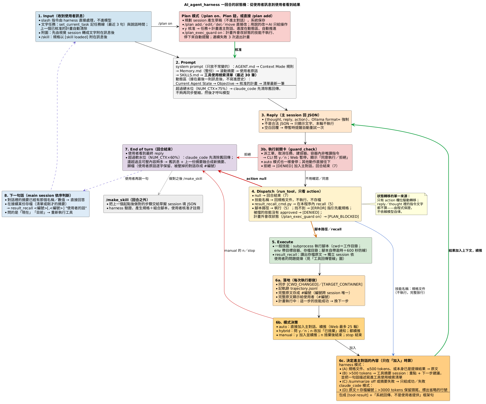

# 架構說明

> 寫給：想看懂或修改 harness 核心的人。[README](../README.md) 是一頁總覽；這份講核心 `agent_core/` 與網頁 `web_app/`：由哪幾塊組成、一回合怎麼跑、工具回傳怎麼處理、狀態存在哪裡、要改某件事該看哪裡。每個機制「為什麼這樣做」與實測數據在〈[設計筆記與已知限制](設計筆記與已知限制.md)〉。文中的函式名稱都可以直接在 `agent_core/`、`web_app/` 裡搜尋，所在模組見第 4 節。

---

## 0. 先回答最常搞混的一題：工具回傳什麼時候會被摘要？

**每次執行腳本，完整原文一定會存檔（`#編號`）並顯示給使用者；要不要「摘要」看上下文模式與大小。** 下面講的是預設的 harness 模式；claude_code 模式（`/context_mode claude_code`）完全不摘要，原文直接進上下文、太大保留頭尾，見第 3.4 節。兩種模式的對照在第 1.1 節。

- **≤500 tokens**：原文直接進主對話，不開任何獨立 session。
- **>500 tokens**：harness 自動開一個一次性的獨立 session（`summarize_tool_result`），拿「完整原文＋使用者的目標＋這一步的目的＋工具使用檢索清單」擷取重點，主對話只收到重點與下一步建議。「工具回傳後馬上又跑一次獨立 session」就是這個：auto 模式下立刻發生；manual／hybrid 模式下在你按「加入」之後才發生（按捨棄就不花這次模型呼叫）。
- **`result_recall` 不是自動的**：它是一個技能，由 main session 判斷「使用者在追問某份存檔」時主動選用；harness 回去讀那一份（或幾份）存檔的完整原文，用同一套擷取邏輯、以使用者現在的問題為錨點重新提煉。

兩者共用同一個核心 `_extract_task_oriented`，差在觸發方式與錨點：

| | 工具摘要 `summarize_tool_result` | 回原文提煉 `result_recall` |
|---|---|---|
| 誰觸發 | harness 自動：回傳 >500 tokens 且要加入主對話 | main session 主動選（`action`） |
| 讀什麼 | 剛執行完的完整輸出 | 已存檔的 1～3 份完整原文 |
| 錨點 | 使用者的目標（Objective、任務線、計畫）＋這一步的目的（thought／reply／action） | 任務線（最新一句＋前幾句）＋模型給的聚焦點 |
| 自動追問（grep 同一份存檔） | 有，最多 2 跳 | 只讀一份時有 |
| 寫進檢索清單 | 會（只有原始工具的結果才寫） | 不會（它是衍生輸出） |
| 給 main session 的 | 重點＋下一步建議 | 重點＋下一步建議 |

---

## 1. 全貌


整個系統是「一個會挑技能的主 session，加上一群只負責讀原文的一次性 session」：

- **主 session**（Ollama `gemma4:e4b`，有對話歷史）每輪只回一個 JSON `{thought, reply, action}`。它不寫程式、不直接讀大量原文；`action` 只能填技能名稱、規格文件標明的腳本路徑，或 `result_recall`。
- **`SkillAgent`**（`agent_core/`）是唯一的核心：組 system prompt、呼叫主 session、依 `action` 派發、執行腳本、存檔、決定工具回傳怎麼進主對話、壓縮上下文、記操作軌跡。CLI（`agent_core/cli.py`，由 `Agent_Runner.py` 啟動）與 Web（`web_app/`，由 `web_console.py` 啟動）都只是它的外殼。
- **一次性獨立 session**：自己的 system／user prompt、不碰主對話、做完即丟，共五種（見第 7 節）。
- **技能系統 `skills_system/`**：索引（`SKILLS.md`，常駐）→ 規格（`tools/<name>.md`，按需載入）→ 腳本（`scripts/<name>_cmd.py`，真正執行）。沒有「技能名稱 → 腳本」的對照表：模型必須先載入規格、讀到真實的腳本路徑才執行得了。
- **`logs/`**：每次工具回傳的原文存檔、工具使用檢索清單、操作軌跡、滾動摘要歸檔、每次模型呼叫的耗時（見第 8 節）。
- **執行前關卡**（`guard.py`）：會改變實體／外部狀態的技能（派工單、取消任務、建容器、容器內非唯讀指令），執行前一律由程式要求使用者確認，任何模式都一樣。
- **評測**（`evals/`）：同一組情境分別用兩種上下文模式跑，比較成功率、呼叫次數、token 與時間（見第 12 節）。

### 1.1 兩種上下文模式（`/context_mode harness|claude_code`）

差別只在「誰決定上下文裡放什麼」。規則文字在 `context_modes/<模式>.md`，接在 `AGENT.md` 後面進 system prompt；程式的分岔在 `turn.py` 的 `_content_for_context`、`context_mode.py`、`tool_summary.py`（recall 的追問與建議）與 `compression.py`（清除舊回傳）。

| | harness（預設） | claude_code |
|---|---|---|
| 想法 | harness 替模型做決定：小模型不擅長在一大段原文裡找東西，就先幫它找好 | 相信模型：原文給它，要查什麼、查多少自己決定；harness 只提供安全網 |
| 大量工具回傳（>500 tokens） | 獨立 session 依問題擷取重點＋下一步建議（第 3.1 節） | 原文直接進上下文；超過 `RAW_RESULT_MAX_TOKENS`（3000）保留頭尾，中間一行註明省略多少、存檔編號、怎麼查（第 3.4 節） |
| 查細節 | 獨立 session 的建議指定下一步（`result_recall …`） | 模型自己選 `result_grep`／`result_view`／`result_recall` |
| `result_recall` | 讀一份時會自動追問；結尾下指令 | 不自動追問；結尾只陳述原文在哪、哪裡沒涵蓋 |
| 檢索清單的描述 | 獨立 session 寫的語意描述 | 程式組的「當時的問題：執行的指令」（不多花模型呼叫） |
| 上下文超過水位 | 滾動摘要 | 先把舊的工具回傳清成「原文在存檔 #N」的佔位（不呼叫模型、可取回），不夠才滾動摘要 |

兩種模式共用：原文存檔與 `#編號`、檢索清單、執行前關卡、長期記憶、滾動摘要（含使用者原話與對話片段存檔）、動態區。切換只影響之後的工具回傳，已經在上下文裡的內容不會回頭改寫。

---

## 2. 一回合怎麼跑（對照程式碼）



以 CLI 的 `main()`（`agent_core/cli.py`）為例（Web 的 `run_turn()`（`web_app/flows.py`）是同一套步驟，對照見第 9 節）：

1. **收訊息**：slash 指令在 `main()` 的 if 鏈直接處理、不進模型。文字任務呼叫 `set_current_task()` 記進任務線 `task_history`（最近 3 句）與說話時間 `_user_said`；`end_plan_for_new_task()` 清掉上一個已核准的計畫；`/skill` 手動載入的規格用 `attach_skill_docs()` 附在訊息後；Plan 模式改走 `_run_plan_flow()`（草稿在一次性的規劃 session 產生與修改，不進主對話，見 `plan.py`）。
2. **組 prompt**：`ask_ai()` 每次都用 `get_system_prompt()` 重組第一則 system 訊息（只放不常變的內容，見第 6 節），再由 `ensure_context_budget()` 檢查硬水位（claude_code 模式先清除舊的工具回傳，不夠才同步壓縮）。送出前 `_with_state_tail()` 把動態區（`build_state_tail()`：Current Agent State、Objective、已核准的計畫、檢索清單最新一筆）接在最後一則訊息後面——只接在這次送出的副本上，不寫進 `messages`。
3. **呼叫主 session**：`_chat_once()` 以 `format=AGENT_REPLY_SCHEMA` 強制 JSON，`parse_agent_reply()` 解析成 `{thought, reply, action, valid}`，並記一筆 `logs/perf.jsonl`。不是合法 JSON 就只顯示、不執行；`reply` 空且 `action` 為 null 時，帶暫時提醒自動重試一次。
4. **執行前關卡**：`guard_check()` 判斷這個 `action` 會不會改變實體／外部狀態（第 3.5 節）。會的話 CLI 問 y／n、Web 暫停顯示「同意執行／拒絕」（`pending["mode"] = "guard"`），任何模式都一樣；拒絕時把 `[DENIED]` 包成工具結果加入 `messages`，回合結束等使用者說明。
5. **派發**：`run_tool(parsed, approved)` 只看 `action`：
   - `null` → 回合結束；
   - `command` 是技能名稱（`tools/<name>.md` 存在）→ 回傳規格文件（附技能經驗記憶），**不執行**；
   - `result_recall_cmd.py` → 在本程序內呼叫 `_result_recall()`（它要呼叫模型，不能包成 subprocess）；
   - 其他 → 當成腳本路徑；`/plan_exec_guard on` 且計畫執行中時，不是目前這一步、又會改變狀態的技能回 `[PLAN_BLOCKED]`、不執行；被擋的技能沒有 `approved=True` 就回 `[DENIED]`、不執行（CLI／Web 以外的呼叫端也擋得住）；其餘由 `_exec_script()` 以 subprocess 執行，找不到腳本就回可行動的 `[ERROR]`，提示先載入規格。
6. **落地**：`_sync_state_from_tool_output()` 讀 `[CWD_CHANGED]`／`[TARGET_CONTAINER]` 更新狀態；`_record_trajectory()` 記軌跡、呼叫 `_archive_tool_result()` 把完整原文存成 `#編號`，再交給 `plan_on_exec()`（計畫執行中：這一步的技能成功就換下一步）。
7. **模式決策**：auto 直接加入並續推；hybrid 問 y／n，n 改加「已捨棄」通知，兩者都續推；manual 按 y 加入並續推，n／stop 結束回合。
8. **決定進主對話的內容**（只有「加入」時才算）：`_content_for_context()` 依上下文模式決定給原文、摘要、原文頭尾或只給成功／失敗（見第 3 節）；`tool_result_message()` 包上 `[tool result]` 與「系統回傳、不是使用者提供」框架句，以 user 角色加入 `messages`，然後回到步驟 2。
9. **模型停下來（`action` 為 null）**：`plan_after_reply()`——計畫剩下的都是不需技能的步驟就算完成；`/plan_exec_guard on` 且還有步驟沒做，就自動送 `[PLAN_CONTINUE]` 提醒下一步、回到步驟 2（連續失敗 3 次退出計畫）。
10. **回合結束**：`after_turn_compression()` 檢查軟水位：claude_code 模式先清除舊的工具回傳，清完還超過、而且可壓的內容夠多，才把舊訊息融合成滾動摘要（第 3.6 節）。

---

## 3. 工具回傳管線


3.1～3.3 是 harness 模式（預設，也是上圖畫的流程）；claude_code 模式在 3.4；3.5 是兩種模式共用的執行前關卡，3.6 是壓縮。

### 3.1 這一次的工具回傳（圖的上半部）

用一個實際例子走一遍：使用者問「tools 資料夾裡的每個技能，在 scripts 資料夾裡都有對應的腳本嗎？」，main session 執行 `ls skills_system/tools`，輸出約 850 tokens，超過 500，於是交給 `summarize_tool_result`：

1. **① 告訴獨立 session「使用者想知道什麼」**：使用者最近說的幾句話、main session 為什麼執行這一步（它的 thought／reply），以及檢索清單上其他存檔的一句話描述——例如「#1 腳本資料夾內容：skills_system/scripts，32 項」。
2. **② 獨立 session 讀完整原文，回答四件事**：
   - 重點：「tools 有 26 個檔案」＋檔名清單；
   - 還缺什麼：「原文沒有 scripts 資料夾的內容，沒辦法比對」；
   - 這份存檔的一句話描述：「tools 資料夾的技能列表：26 個檔案…」；
   - 還需要哪幾份舊存檔：「#1，scripts 的清單在那份」。程式會檢查 #1 真的在清單上，小模型編出來的編號會被丟掉。
3. **③ 自動追問**：只在「有缺口、而且沒指到別份存檔」時做，意思是缺的東西可能就藏在這份原文裡、摘要時沒看到（例如原文太長只讀了頭尾）。做法是拿獨立 session 自己建議的關鍵字在這份原文裡搜，搜到就針對那段再讀一次補上，搜不到就停。例子：讀 5 秒的 `/diagnostics` 後說「沒找到 motor_rear_left 的溫度」，並建議關鍵字 `motor_rear_left_temp`，一搜就找到「41.2」。上面 tools 的例子已經指到 #1，缺的在別份存檔裡，所以不追問。
4. **④ 一句話描述寫進工具使用檢索清單**（`tools_use_index.md`），之後每一輪都看得到。
5. **⑤ 附上下一步建議**，連同重點交給 main session。這個例子的建議是「下一輪執行 `result_recall 2,1 "<使用者的話>"`」：把 tools（#2）和 scripts（#1）兩份原文一起交給同一個獨立 session 比對。

對照程式碼：

| 步驟 | 函式 | 做什麼 |
|---|---|---|
| 存檔 | `_record_trajectory` → `_archive_tool_result` | 每次執行都存 `logs/tool_results/<session>_<編號>_<腳本>.md`（key: value 檔頭＋原文），`index.md` 追加一行 |
| 判斷 | `_content_for_context`、`is_exempt_result` | 規格文件、≤500 tokens、或本身已是提煉結果（`TOOL_SUMMARY_TAG` 開頭）→ 原文；`/summarize off` 或摘要失敗 → 只給成功／失敗 |
| 組錨點 | `summarize_tool_result`、`_build_task_anchor_text`、`_last_assistant_step` | 使用者的目標＋這一步的目的；原文超過 16000 字只讀頭尾（`_clip_tool_output`） |
| 擷取 | `_extract_with_followups` → `_extract_task_oriented` | 附上檢索清單（`_tool_use_catalog`，排除這一份），以 `format=TOOL_SUMMARY_SCHEMA` 取得 answer／facts／errors／not_covered／suggested_questions／index_hint／related_records |
| 自動追問 | `_extract_with_followups`、`_merge_followup` | 有缺口、沒有 related、未滿 2 跳時，用摘要自己給的關鍵字 `result_grep` 同一份存檔再擷取；0 行命中就停；結果併回第一輪（回答用新的、事實取聯集、index_hint 留第一輪） |
| 驗證 | `_validate_related` | related_records 只留清單裡真的有的編號，最多 2 筆 |
| 寫清單 | `_append_tool_use_index`、`tidy_hint` | 只有原始工具的結果才寫一行進 `tools_use_index.md`（`result_*` 這類衍生輸出不寫）；描述整句照存、**不截斷**（只收空白、去掉結尾的「…」），長度由 prompt 要求模型寫在 60 字左右的完整一句話（`TOOL_USE_INDEX_HINT_TARGET`） |
| 排版 | `_render_tool_summary`、`_followup_guidance` | 回答／相關事實／錯誤／未涵蓋／還需要的舊存檔／延伸方向（不附 grep 關鍵字），結尾附下一步建議 |

下一步建議（`_followup_guidance`）依序判斷：

1. 還需要之前的存檔 → 直接給合併指令 `result_recall 這份,那份 "<使用者的話>"`（幾份交給同一個獨立 session，才比得了）；
2. 自動追問也解不開的缺口 → 用自然的一句話問使用者；
3. 已經回答 → 直接回答，不必 recall。

「什麼時候不需要 recall」由看過完整原文的獨立 session 明說，main session 不必自己猜。

### 3.2 之後任何一回合（圖的下半部）

`get_system_prompt()` 尾端由 `_tool_use_index_block()` 注入檢索清單最近 30 筆（格式 `#編號（時間）：描述`），並附上依序判斷的規則：對話裡已經有答案 → 直接回答；在接續某份存檔 → `result_recall`；問「現在」的狀態 → 重新執行工具；都不像 → 當作新問題。清單一千多 tokens、只在跑完獨立 session 時多一筆，所以留在 system prompt（KV cache 大多命中）；對話一長，system prompt 的尾端會落在整段上下文的中間，所以動態區另外用一行（`tool_use_index_pointer`）提示最新一筆。

main session 執行 `result_recall <編號>[,<編號>] "<使用者的話>"` 時，`_result_recall()` 回去讀那一份（或幾份）存檔的完整原文，走上面 ①②③⑤ 同一套流程重新提煉。跟 3.1 不同的只有三點：

- **①「使用者想知道什麼」怎麼給**：用 harness 自己記的使用者最近 3 句話（任務線），最新一句當問題、前兩句當背景。因為使用者回答追問時常常只說「第一個」「好」「那溫度呢」，單看這一句不知道在問什麼，要靠前幾句補上意思。這是實際發生過的：`result_recall` 以前只拿最新一句，結果獨立 session 收到的問題是「第一個」。
- **main session 寫的那段問題只當補充重點**：`result_recall 12 "哪些檔案跟記憶有關"` 引號裡是 main session 自己寫的，harness 不直接拿它當使用者的問題，只附在後面當「要特別注意的點」。原因也是實測：小模型有時會把清單上的描述抄進引號（例如「列出 skills_system/scripts 資料夾內所有腳本檔案…」），拿它當問題就錨錯了；跟使用者原話或清單描述一模一樣時，乾脆不附。
- **③ 自動追問只在讀一份時做**：一次讀好幾份時，每一份的原文都已經給了，而且自動追問的搜尋一次只能搜一份存檔。

**提煉結果不寫進檢索清單。**清單記的是「原始來源」：每一筆代表一份原始工具輸出、指向它的完整原文。recall 沒有產生新資料，只是換一個問題重讀已經存在的原文。如果把它也寫進去：

- 同一份來源會在清單上佔兩格（例如 #12 是 tools 清單，recall 後的 #13 又描述一次 tools 清單），30 筆的顯示視窗很快被重複的內容佔滿；
- recall 的存檔裡只有「提煉後的重點」，不是完整原文。之後如果有人 recall 到這一筆，獨立 session 讀到的是摘要的摘要，資訊比直接 recall #12 少。

所以原本那一筆（#12）留在清單上、繼續指向完整原文；recall 本身仍然記進操作軌跡和 `index.md`（所有執行的稽核清單），只是不進檢索清單。另外，recall 的輸出開頭是 `TOOL_SUMMARY_TAG`，交給 `_content_for_context` 時會被判定成「已經提煉過」，直接給 main session，不會再摘要一次。

### 3.3 為什麼編號跨 session 唯一

`SkillAgent.__init__` 從既有存檔的最大編號續編（`_max_archived_id`），所以清單上的 `#16` 在任何一次啟動都只指向同一份存檔，模型只要抄數字。要整個重來，請刪整個 `logs/tool_results/`（連同 `tools_use_index.md`）；只刪存檔會讓編號重新從 1 起算，跟清單對不上。配號一律走 `_next_id()`（上鎖：背景壓縮也會為被壓縮的對話片段配號）。

### 3.4 claude_code 模式

`_content_for_context()` 在 claude_code 模式把所有工具回傳交給 `raw_result_for_context()`，不呼叫任何模型：

1. 第一行註明 `（完整原文存檔 #N，約 X tokens）`，接著是完整原文。
2. 超過 `RAW_RESULT_MAX_TOKENS`（3000）：開頭改成 `[tool result - 原文頭尾]`，只留頭 60%、尾 40%，中間換成一行「省略約多少 tokens；完整原文在 #N：找字串用 `result_grep`、看某段用 `result_view`、要依問題整理用 `result_recall`」。
3. 超過 500 tokens 的回傳照樣記進檢索清單，描述由程式組：`<當時使用者的問題>：<技能 參數>`。

要不要回存檔查、用哪一個工具查，由模型自己決定；規則在 `context_modes/claude_code.md`（三個存檔工具的語法直接寫在裡面，不必先載入規格）。`result_recall` 在這個模式下仍然是「把一大份原文交給獨立 session 依問題提煉」，也就是模型自己選擇委派的 subagent；差別是不做自動追問、結尾不下指令（`_followup_guidance(directive=False)`）。

**實測提醒**（〈設計筆記〉2.11）：gemma4:e4b 在這個模式下，要找的東西落在被截掉的中段時幾乎都不會回存檔查，而是回答「資料裡沒有」；把 `AGENT_RAW_RESULT_MAX_TOKENS` 調到常見輸出放得下（例如 6000）時才可靠。

原文直接進上下文，上下文漲得比 harness 模式快，所以超過水位時先做最輕量、可還原的壓縮：`clear_old_tool_results()` 把較舊的工具回傳（最新 `CLEAR_KEEP_RECENT_RESULTS` 則以外、每則至少 300 tokens、帶存檔編號的）換成 `[tool result - 已清除]` 佔位，內容是「原文在 #N（當時執行什麼），需要時用 result_view／result_grep／result_recall 取回」，保留 `[tool result]` 第一行與框架句。清完還超過才做滾動摘要。清除會讓 KV cache 從被清的那一則開始失效，所以只在超過水位時做，不是每輪都做。

### 3.5 執行前關卡（兩種模式共用）

`guard_check(parsed)` 回傳 `None`（不用確認）或 `{skill, script, command, reason}`：

- 只看要執行的腳本：技能名稱（載入規格）、找不到的腳本、偽技能（`result_recall`）都不用確認。
- 被擋的技能：`GUARDED_SKILLS`（預設 `workpackage_send`、`workpackage_cancel`、`overpending_cancel`、`docker_est`、`docker_runcmd`，`AGENT_GUARDED_SKILLS` 可覆寫）。
- 例外：`workpackage_send --dry-run`（只顯示不送）；`docker_runcmd` 的指令通過 `is_readonly_shell()`：每一段（`&&`、`||`、`;`、`|` 分隔）的第一個字在唯讀白名單裡（`ls`、`cat`、`grep`、`cd`…），而且沒有寫檔的轉向（`/dev/null` 除外）、反引號或 `$( )`。有些指令要看參數：`ros2` 只認查詢類的動作（`topic list/echo/info`、`node list/info`、`param get`…）；`source` 只認 `setup.bash` 這類環境設定檔；`find` 不能帶 `-delete`／`-exec`；`sort -o`、`tree -o`、`date -s`、`uniq 輸入 輸出` 會寫檔或改狀態；`env`、`hostname` 只有不帶參數時算唯讀。判斷不了的一律要確認。
- 組合技能（`/make_skill` 產生的資料檔）：讀它的 `STEPS`，只要有一步是被擋的技能（且不符合例外），整支都要確認。
- `/guard off` 只對目前 session 關閉；`AGENT_GUARD=0` 改預設值。

確認由程式路徑保證：CLI／Web 先問，同意後才以 `run_tool(parsed, approved=True)` 執行；`run_tool` 自己也會再檢查一次，沒有 `approved` 就回 `[DENIED]`，所以評測、其他呼叫端漏接確認時也不會執行。Plan 模式核准計畫不等於核准每一個會改變狀態的動作，執行時一樣會問。

### 3.6 壓縮：使用者原話與對話片段存檔（兩種模式共用）

滾動摘要本身沒變（上一份摘要＋要壓的舊訊息 → 新的一份，`SUMMARY_SCHEMA`），摘要長度目標從 600 字放寬到 1500 字（`SUMMARY_MAX_CHARS`）。`_apply_compression()` 多做兩件事：

1. **使用者原話由程式逐字保留**（`_keep_user_words`）：被壓掉的訊息裡使用者自己打的字（`_user_text_of`：去掉附圖分析、手動載入的規格，規劃請求取出裡面的原話），附上說話時間，放進 system prompt 的「使用者說過的話」一節；總字數超過 `USER_WORDS_MAX_CHARS`（2000）丟最舊的並註明還有幾則。摘要模型只需要寫歸納後的偏好，不必照抄原話。
2. **被壓掉的對話片段存成一份存檔**（`_archive_conversation_segment`）：跟工具回傳同一套 `#編號`、同一個目錄（腳本欄寫 `conversation_segment`），內容保留 AI 的想法、回覆、action 與工具回傳全文，並記進檢索清單，描述是摘要模型另外寫的 `segment_hint`——**只描述被壓掉的這一段**（談了什麼、查到什麼、決定了什麼），不是滾動摘要的 overview（那是融合後的整段歷史，每份片段拿到的都差不多、又被截成「本次對話的重點是…」，認不出是哪一段）；模型沒給時退回這一段裡使用者的原話（`_segment_hint`）。存檔檔頭的 `task` 欄也寫這一句。
3. **對話片段跟工具回傳分開呈現、分開保留**：編號仍是同一個序列（一個 `#編號` 只對應一份存檔，`result_recall` 兩種都能用，小模型不必多學技能），但 system prompt 另有「過去的對話片段」一節（`_conversation_index_block`，最近 `CONVERSATION_ARCHIVES_SHOW`＝10 份，每份附描述），不跟工具回傳搶那 30 筆名額；清單行以檔名的 `_conversation_segment.md` 區分種類，舊的清單行也分得出來。保留上限也分開：工具回傳 200 檔／50 MB 的輪替不會刪對話片段，對話片段另外只留最近 `CONVERSATION_SEGMENTS_KEEP`＝100 份。`result_recall` 取回對話片段時會告訴獨立 session「這是過去的對話，不是工具輸出」，要它回答當時談了什麼、決定了什麼、使用者怎麼說——這就是工具回傳那套可還原壓縮，用在對話本身。

使用者原話與對話片段編號跟滾動摘要一起寫進 `logs/summary_*.json`，下次啟動時由 `_load_latest_summary_state()` 接回。

---

## 4. 模組地圖

2026-09-26 起，原本的兩個大檔拆成兩個資料夾，功能不變；根目錄的 `Agent_Runner.py`、`web_console.py` 只剩幾行，負責啟動。

```
Agent_Runner.py   → agent_core/cli.py 的 main()      （python3 Agent_Runner.py）
web_console.py    → web_app/server.py 的 main()      （python3 web_console.py）
```

### 4.1 `agent_core/`：核心（原 `Agent_Runner.py`）

`SkillAgent` 是把幾個 mixin 組起來的類別（`agent.py`）。每個 mixin 只負責一件事，方法之間一律透過 `self` 呼叫，所以不論方法放在哪個檔案，用起來都跟以前一樣是 `agent.run_tool(...)`。

| 模組 | 行數 | 內容 |
|---|---|---|
| `agent.py` | 229 | `SkillAgent`：組合各 mixin；`__init__`（所有狀態的初始值，見第 5 節）與 token 計量（`count_tokens`、`context_tokens`、`_record_usage`） |
| `conversation.py` | 152 | `ConversationMixin`：`set_current_task`（任務線、說話時間）、`reset_conversation`（/clear）、`ask_ai`（動態區、空白回覆重試）、`_with_state_tail`、`_chat_once`（含耗時紀錄）、`parse_reply` |
| `prompt.py` | 142 | `PromptMixin`：`get_system_prompt`（不常變的部分）、`build_state_tail`（動態區）、`load_long_term_memory`、「使用者說過的話」區塊、任務錨點 `_build_task_anchor_text`、`end_plan_for_new_task`（執行中的計畫保留） |
| `dispatch.py` | 241 | `DispatchMixin`：`run_tool`（兩階段揭露、偽技能攔截、沒核准就不執行被擋的技能）、`_exec_script`（subprocess、環境變數、600 秒防線）、`_load_skill_doc`、`list_skills`、狀態標記同步 |
| `plan.py` | 360 | `PlanMixin`：/plan 草稿（規劃 session 產生、`/plan add…` 指令或用說的修改——只套用操作）、核准、依執行紀錄自動推進、`/plan_exec_guard` 的執行前檢查與自動提醒、連續失敗退出 |
| `guard.py` | 225 | `GuardMixin`：執行前關卡 `guard_check`、唯讀指令判斷 `is_readonly_shell`、組合技能的步驟檢查、給使用者與模型的說明文字 |
| `context_mode.py` | 136 | `ContextModeMixin`：`set_context_mode`、各模式的規則文字、claude_code 模式的 `raw_result_for_context`（原文／頭尾）與 `clear_old_tool_results`（清除舊回傳） |
| `tool_summary.py` | 435 | `ToolSummaryMixin`：`summarize_tool_result`、`_result_recall`，以及它們共用的 `_extract_task_oriented`、`_extract_with_followups`（自動追問）、`_validate_related`、`_followup_guidance`（下一步建議；claude_code 模式只陳述）、`_render_tool_summary` |
| `tool_use_index.py` | 168 | `ToolUseIndexMixin`：`tools_use_index.md` 的寫入（`_append_tool_use_index`、`tidy_hint`，不截斷）、依種類讀取（`_tool_use_index_rows(kind=…)`、`is_conversation_file`）、system prompt 的兩區（工具回傳 `_tool_use_index_block`，依模式不同；過去的對話片段 `_conversation_index_block`）與動態區的最新一筆（`tool_use_index_pointer`） |
| `archive.py` | 120 | `ArchiveMixin`：原文存檔 `_archive_tool_result`、`index.md`、保留上限 `_prune_tool_results`（工具回傳與對話片段分開算）、`_max_archived_id`（跨 session 續編）、`result_file_path`（Web 開原文用） |
| `trajectory.py` | 182 | `TrajectoryMixin`：`_next_id`（全域配號）、`_record_trajectory`（每執行一支腳本記一筆、觸發存檔）、起點、`/trajectory` 的顯示與步驟挑選 |
| `compression.py` | 516 | `CompressionMixin`：`_split_for_compression`（保留區切點）、`summarize_messages`（滾動摘要 session）、使用者原話與對話片段存檔、`compress_context_to_file`、背景壓縮、`ensure_context_budget`（硬水位）、`_load_latest_summary_state`（啟動時接回） |
| `make_skill.py` | 550 | `MakeSkillMixin`：`/make_skill` 的草擬、驗證、產生規格與組合腳本、重播、註冊 |
| `perf.py` | 56 | `PerfMixin`：`_timed_chat`（獨立 session 呼叫模型都走這裡）、`_perf_record`（寫 `logs/perf.jsonl`） |
| `turn.py` | 131 | CLI 與 Web 共用的回合函式：`_content_for_context`（工具回傳進主對話的幾條路）、`oversized_notice`、`context_kind`、`after_turn_compression`（軟水位）、`_append_discarded_tool_result` |
| `protocol.py` | 107 | 回覆協議與訊息包裝：`parse_agent_reply`、`action_text`、`tool_result_message`、`attach_skill_docs`、`is_exempt_result` |
| `schemas.py` | 154 | Ollama `format=` schema：`AGENT_REPLY_SCHEMA`、`SUMMARY_SCHEMA`、`TOOL_SUMMARY_SCHEMA`、`MAKE_SKILL_SCHEMA`、`PLAN_DRAFT_SCHEMA`、`PLAN_OPS_SCHEMA` |
| `config.py` | 236 | 所有常數與環境變數（第 10 節），以及 `PROJECT_ROOT`（專案根目錄，`AGENT.md`、`skills_system/`、`logs/` 都以它為準） |
| `cli.py` | 393 | CLI：`main()`（slash 指令、回合迴圈、執行前確認、auto／hybrid／manual 決策）、`_run_plan_flow`（草稿的核准與修改，規劃階段不呼叫 `run_tool`）、`execute_turn`（一個回合）、`_run_make_skill_flow` |

依賴方向是單向的：`config`、`schemas` 不依賴其他模組，`protocol` 只依賴 `config`；各 mixin 只依賴這三個，另外 `compression`、`context_mode` 借用 `tool_use_index.tidy_hint` 這個純函式（`archive` 借用 `is_conversation_file`），mixin 類別之間不互相 import；`agent` 組合所有 mixin；`turn`、`cli` 在最上層。沒有循環 import。

### 4.2 `web_app/`：網頁介面（原 `web_console.py`）

| 模組 | 行數 | 內容 |
|---|---|---|
| `state.py` | 73 | 全域狀態：唯一的 `SkillAgent` 實例、模式開關 `state`、待決策事項 `pending`（工具結果，或執行前關卡的待確認動作）、待核准的計畫、附件、手動載入的技能規格 |
| `flows.py` | 358 | 回合流程：`run_turn`（ask_ai → 執行前關卡 → run_tool 迴圈）、`_handle_tool_result`（執行後的共用處理）、`apply_decision`（guard／manual／hybrid 的決策）、Plan 模式、技能草稿、附圖的視覺 sub-session、狀態列 `build_stats` |
| `commands.py` | 336 | slash 指令：`handle_slash_command`（含 `/context_mode`、`/guard`）、「/」選單清單 `SLASH_COMMANDS`、`/menu` 的說明文字 |
| `server.py` | 366 | HTTP：`ConsoleHandler`（`/`、`/api/*`、`/static/vision/*` 路由）、NDJSON 串流 `EventStream`、`main()` |
| `static/index.html` | 680 | 網頁本身（HTML／CSS／JS 都在這一個檔案，無外部依賴）；執行前確認列、標題列的上下文模式與任務進度 |

各模組共用 `state.py` 裡的同一批物件（都是可變的 dict／物件，沒有任何地方重新賦值），所以拆開後大家看到的仍是同一份狀態。依賴方向：`flows` 與 `commands` 各自只依賴 `state`（和 `agent_core`），`server` 再把三者接起來。

拆分時用程式依語法樹把每段程式碼連同註解原封不動搬過去，並以「重構前後同一組假模型情境的完整輸出與送給模型的每一個 prompt 逐字相同」驗證（51 項核心輸出、45 項 Web 輸出、19 次模型呼叫），再用真模型跑過一次完整任務。

---

## 5. SkillAgent 的狀態

| 類別 | 屬性 | 說明 |
|---|---|---|
| 對話 | `messages`、`messages_lock` | 第一則永遠是 system prompt（每次 `ask_ai` 重組），之後是 user／assistant；工具回傳以 user 角色、`[tool result]` 開頭。動態區不在這裡（只接在送出的副本上） |
| 模式與關卡 | `context_mode`、`guard_enabled` | 上下文模式（`/context_mode`，預設 `AGENT_CONTEXT_MODE`）、執行前關卡（`/guard`，預設 `AGENT_GUARD`） |
| 計畫 | `plan`、`plan_exec_guard` | /plan 的草稿與進度（`{task, steps:[{skill, goal, status}], status, failures}`，status＝draft／active／done／aborted）、執行前檢查開關 |
| 任務錨點 | `current_task`、`task_history`、`_user_said`、`sticky_objective`、`current_plan` | 給獨立 session 當「使用者的目標」；`_user_said` 記每句話的時間（壓縮時保留原話用） |
| 環境狀態 | `current_cwd`、`container_cwd`、`target_container` | 由腳本輸出的狀態標記同步；顯示在動態區的 Current Agent State，並以 cwd／環境變數傳給腳本 |
| token 計量 | `chars_per_token`、`last_prompt_tokens`、`last_tail_chars`、`total_*_tokens` | 估算與校準（Ollama 沒有 tokenize API）；`context_tokens()` 會加上動態區的大小 |
| 壓縮 | `rolling_summary`、`user_words`、`user_words_dropped`、`conversation_archives`、`_compress_thread`、`last_compression`、`last_clearing` | 最新一份滾動摘要、逐字保留的使用者原話、被壓縮的對話片段存檔編號（三者啟動時從最新的 `summary_*.json` 接回）、背景壓縮執行緒、claude_code 模式最近一次清除的統計 |
| 記憶 | `memory_dropped`、`_memory_warning` | `Memory.md` 超過載入上限沒載入的條數，與待送給 UI 的提醒 |
| 存檔與軌跡 | `session_id`、`trajectory`、`trajectory_seq`、`_id_lock`、`last_result_id`、`last_result_file`、`last_tool_summary` | 編號＝軌跡 id，跨 session 續編，`_next_id()` 上鎖配號 |
| 耗時 | `perf_calls`、`last_perf`、`_side_calls_since_main`、`_last_main_sys_hash`、`_history_rewritten` | 最近 200 次模型呼叫的計量，以及判斷 KV cache 能不能命中的三個旗標 |
| make_skill | `pending_skill_draft`、`skill_model`、`drafts_dir` | 等待核准的技能草稿 |

`/clear`（`reset_conversation`）只清對話、計畫與任務線；滾動摘要、使用者原話、工作目錄、目標容器、Objective、存檔與檢索清單都不清。

---

## 6. system prompt 與動態區

Ollama 只重用跟上一次請求相同的開頭，從第一個不同的 token 開始全部重算，所以內容依「多久變一次」排列。

**system prompt**（`get_system_prompt()`，只放不常變的）依序是：

1. `AGENT.md`：角色、JSON 回覆格式、執行協議、安全原則、記憶協議
2. Context Mode：目前模式的規則（`context_modes/<模式>.md`）
3. `Memory.md`：整份（以條目計，超過 `MEMORY_MAX_CHARS` 才丟最舊的並註明），開頭一句說明寫入時間的意義
4. 最新一份滾動摘要
5. 使用者說過的話（被壓縮掉的原話＋對話片段存檔編號，壓縮過才出現）
6. `SKILLS.md` 技能索引
7. 工具使用檢索清單（最近 30 筆，有存檔時才出現）

這些只在壓縮、寫記憶、註冊技能、檢索清單多一筆、切換模式時才變。

**動態區**（`build_state_tail()`，每次送出時接在最後一則訊息後面，以 `[harness state]` 開頭）：

1. Current Agent State：工作目錄、容器內目錄、目標容器
2. Objective（有設定時）
3. 已核准的計畫與進度（`plan_block`：執行中才出現，`[→]` 是目前這一步）
4. 檢索清單最新一筆（有存檔時）

動態區很小（通常幾百 tokens），每次都要重算，但換來切目錄、勾任務時不必讓整段歷史重算，而且它離生成點最近，小模型最看得到。它不寫進 `messages`，所以歷史一個字都沒變，壓縮也沖不掉它（每次都重新產生）。實際的 cache 效果用 `evals/perf_report.py` 看（第 12 節）。

---

## 7. 五種一次性獨立 session

| session | 方法 | 什麼時候跑 | 輸入 | 輸出（Ollama `format=`） |
|---|---|---|---|---|
| 工具摘要 | `summarize_tool_result` | harness 模式、工具回傳 >500 tokens 且要加入主對話 | 原文＋使用者目標＋這一步的目的＋檢索清單 | `TOOL_SUMMARY_SCHEMA` |
| 回原文提煉 | `_result_recall` | main session 執行 `result_recall` | 1～3 份存檔原文＋任務線＋聚焦點＋檢索清單 | `TOOL_SUMMARY_SCHEMA` |
| 滾動壓縮 | `summarize_messages` | 回合結束超過軟水位、呼叫前超過硬水位、或 `/compress` | 上一份摘要＋要壓的舊訊息 | `SUMMARY_SCHEMA` |
| 視覺 | `web_app/flows.py` 的 `_run_vision_subsession`（`vision.analyze`） | Web 附圖時 | 影像＋使用者訊息 | 文字，以 `[vision result]` 附在訊息後 |
| 計畫草稿 | `plan_start_draft`、`_plan_revise` | `/plan on` 後的新任務、草稿時用說的修改 | 技能清單＋任務（或目前草稿＋修改意見） | `PLAN_DRAFT_SCHEMA`／`PLAN_OPS_SCHEMA` |
| 技能草擬 | `draft_skill_from_trajectory` | `/make_skill` | 軌跡步驟＋計畫＋任務 | `MAKE_SKILL_SCHEMA` |

前三種用 `summary_model`（`AGENT_SUMMARY_MODEL`，預設同主模型）並關閉 thinking（`think=False`）。與主模型相同時，Ollama 單 slot 會讓它們跟主對話依序執行，每次多等幾秒，而且會把主對話的 KV cache 洗掉，下一次主對話整段重算。除了視覺，都經過 `_timed_chat()` 記進 `logs/perf.jsonl`。

---

## 8. 存在哪裡、活多久

| 路徑 | 內容 | 誰寫 | 保留 |
|---|---|---|---|
| `logs/tool_results/<session>_<編號>_<腳本>.md` | 每次執行腳本的完整原文（技能規格載入不存）；被壓縮的對話片段也存在這裡（腳本欄 `conversation_segment`） | `_archive_tool_result`、`_archive_conversation_segment` | 工具回傳最近 200 檔／50 MB；對話片段另外最近 100 份，互不影響 |
| `logs/tool_results/index.md` | 每份存檔一行（編號、腳本、狀態、任務、摘要回答；任務與回答整句照存、不截斷），`result_list` 讀它 | `_archive_tool_result`、`update_result_answer` | 跟著存檔一起刪 |
| `logs/tool_results/tools_use_index.md` | 大量回傳（與被壓縮的對話片段）的一句話描述，整句不截斷；system prompt 分兩區顯示：工具回傳最近 30 筆、對話片段最近 10 份 | `_append_tool_use_index` | 永久累加 |
| `logs/trajectory.jsonl` | 每次執行與起點（/clear、計畫核准、make_skill） | `_append_trajectory_log` | 永久累加 |
| `logs/summary_*.md`／`.json` | 滾動摘要歸檔；`.json` 另存使用者原話與對話片段編號；啟動時接回最新一份 | `_archive_summary` | 最近 30 份 |
| `logs/plan_draft.md` | 目前的計畫草稿與進度（給人看；程式以記憶體裡的 `plan` 為準） | `_plan_save` | 每次改動覆寫 |
| `logs/perf.jsonl` | 每次模型呼叫的種類、token、毫秒、呼叫前 system prompt 有沒有變等（`AGENT_PERF_LOG=0` 關閉） | `_perf_record` | 永久累加 |
| `Memory.md` | 全域記憶（使用者明確要求時寫入），整份進 system prompt（超過 `MEMORY_MAX_CHARS` 才丟最舊的並提醒） | `modify_memory` | 手動管理 |
| `skills_system/memory/<name>.md` | 綁定某技能的經驗記憶，載入該技能規格時附上 | `modify_memory --skill` | 手動管理 |
| `skills_system/drafts/<name>/` | `/make_skill` 還沒核准的草稿 | `write_skill_draft` | 核准或取消時刪除 |

`logs/` 與 `skills_system/drafts/` 都在 `.gitignore`（工具輸出可能含敏感內容）。

---

## 9. CLI 與 Web Console 的對應

`web_app/` 不重寫任何規則，只把同一套步驟改成「每個 HTTP 請求處理一段、以 NDJSON 串流逐筆推事件」：

| 步驟 | CLI（`agent_core/cli.py`） | Web（`web_app/`） |
|---|---|---|
| 收訊息 | `input()` 迴圈 | `POST /api/send` → `server.py` 的 `_handle_send` |
| slash 指令 | `main()` 的 if 鏈 | `commands.py` 的 `handle_slash_command` |
| 回合迴圈 | `while True`（沒有輪數上限） | `flows.py` 的 `run_turn`（auto 最多 25 輪） |
| 執行前確認 | `guard_check` → `input()` 問 y／n | `run_turn` 暫停（`pending["mode"]="guard"`）→ 「同意執行／拒絕」→ `POST /api/decision` → `apply_decision` 的 guard 分支 |
| 工具結果決策 | `input()` 問 y／n／stop | `POST /api/decision` → `flows.py` 的 `apply_decision` |
| 切換上下文模式／關卡 | `/context_mode`、`/guard` | 同名 slash 指令；標題列顯示 `ctx-mode` |
| 進主對話的內容 | `_context_content_for_cli` → `_content_for_context` | `_content_for_context` ＋ `_emit_context_event` |
| Plan 模式 | `_run_plan_flow`（`📝 計畫>` 提示符）＋`/plan add…` | `start_plan_flow`、`handle_plan_response`（Plan 鈕＝`/plan on`／`off`；草稿時輸入框的內容都交給計畫處理） |
| /make_skill | `_run_make_skill_flow` | `handle_skill_draft_response` |
| 附圖 | 無 | `_run_vision_subsession` |
| 回合結束 | `after_turn_compression` | `after_turn_compression` |

---

## 10. 常數與環境變數

| 常數 | 預設 | 環境變數 | 作用 |
|---|---|---|---|
| `NUM_CTX` | 32768 | `AGENT_NUM_CTX` | 每次請求的 context 上限，所有 session 共用 |
| `TOKEN_THRESHOLD`／`SOFT_TOKEN_THRESHOLD` | NUM_CTX×0.75／×0.60 | `AGENT_HARD_RATIO`／`AGENT_SOFT_RATIO` | 硬水位（呼叫前一定壓）／軟水位（回合結束後壓） |
| `KEEP_RECENT_TOKENS` | NUM_CTX×0.15 | — | 壓縮時保留最新這麼多 token 的原文 |
| `TOOL_RESULT_TOKEN_THRESHOLD` | 500 | — | 工具回傳超過就交給工具摘要 session |
| `TOOL_SUMMARY_DEFAULT` | 開 | `AGENT_TOOL_SUMMARY` | `/summarize` 的啟動值 |
| `TOOL_SUMMARY_INPUT_MAX_CHARS` | 16000 | `AGENT_TOOL_SUMMARY_INPUT_CHARS` | 獨立 session 一次最多讀多少原文（超過只讀頭尾） |
| `TOOL_SUMMARY_MAX_FOLLOWUP_HOPS` | 2 | `AGENT_TOOL_SUMMARY_MAX_HOPS` | 自動追問最多幾跳 |
| `TOOL_USE_INDEX_SHOW` | 30 | `AGENT_TOOL_USE_INDEX_SHOW` | 檢索清單顯示筆數；0 關閉顯示（寫入不受影響） |
| `TOOL_USE_INDEX_HINT_TARGET` | 60 | — | prompt 要求的描述長度（中文字數，一段英數算 1 字）；只是給模型的目標，程式不截斷 |
| `CONVERSATION_ARCHIVES_SHOW` | 10 | `AGENT_CONVERSATION_ARCHIVES_SHOW` | system prompt「過去的對話片段」顯示幾份 |
| `RECALL_MAX_RECORDS` | 3 | — | `result_recall` 一次最多讀幾份 |
| `TOOL_RESULTS_KEEP`／`TOOL_RESULTS_MAX_MB` | 200／50 | `AGENT_TOOL_RESULTS_KEEP`／`AGENT_TOOL_RESULTS_MAX_MB` | 工具回傳原文存檔的保留上限（不含對話片段） |
| `CONVERSATION_SEGMENTS_KEEP` | 100 | `AGENT_CONVERSATION_SEGMENTS_KEEP` | 對話片段存檔的保留上限，跟工具回傳分開算 |
| `SUMMARY_ARCHIVE_KEEP` | 30 | `AGENT_SUMMARY_KEEP` | 滾動摘要歸檔份數 |
| `SUMMARY_MAX_CHARS`／`SUMMARY_MAX_PREDICT` | 1500 字／2500 tokens | — | 滾動摘要的長度目標／輸出上限（舊值 600／2000） |
| `USER_WORDS_MAX_CHARS`／`USER_WORD_MAX_CHARS` | 2000／300 | `AGENT_USER_WORDS_MAX_CHARS` | 逐字保留的使用者原話總字數／每則上限 |
| `MEMORY_MAX_CHARS` | 4000 | `AGENT_MEMORY_MAX_CHARS` | `Memory.md` 載入上限（字元；超過丟最舊的並提醒） |
| `CONTEXT_MODE_DEFAULT` | harness | `AGENT_CONTEXT_MODE` | 啟動時的上下文模式 |
| `RAW_RESULT_MAX_TOKENS` | 3000 | `AGENT_RAW_RESULT_MAX_TOKENS` | claude_code 模式單一回傳進上下文的上限（超過保留頭尾） |
| `CLEAR_KEEP_RECENT_RESULTS`／`CLEAR_MIN_TOKENS` | 3／300 | `AGENT_CLEAR_KEEP_RESULTS` | claude_code 模式清除舊回傳時保留最新幾則／小於多少不清 |
| `GUARDED_SKILLS` | workpackage_send、workpackage_cancel、overpending_cancel、docker_est、docker_runcmd | `AGENT_GUARDED_SKILLS`（逗號分隔，none＝不擋） | 執行前要確認的技能 |
| `GUARD_DEFAULT` | 開 | `AGENT_GUARD` | 執行前關卡的啟動值 |
| `PLAN_MAX_FAILURES`／`PLAN_MAX_STEPS` | 3／12 | — | 計畫連續失敗幾次退出／最多幾步 |
| `PLAN_EXEC_GUARD_DEFAULT` | 關 | `AGENT_PLAN_EXEC_GUARD` | `/plan_exec_guard` 的啟動值 |
| `PERF_LOG_ENABLED` | 開 | `AGENT_PERF_LOG` | 寫不寫 `logs/perf.jsonl` |
| `SUMMARY_MODEL`／`SKILL_MODEL` | 同主模型 | `AGENT_SUMMARY_MODEL`／`AGENT_SKILL_MODEL` | 獨立 session／make_skill 草擬用的模型 |
| `PARALLEL_CAL_DEFAULT` | 關 | `AGENT_PARALLEL_CAL` | 軟水位壓縮改在背景執行緒 |
| `TOOL_EXEC_TIMEOUT` | 600 秒 | — | 單一腳本的最後防線逾時 |

---

## 11. 要改某件事，該看哪裡

| 想做的事 | 看哪裡 |
|---|---|
| 改主模型的行為規則 | `AGENT.md`（整份進 system prompt）；只跟某個上下文模式有關的放 `context_modes/<模式>.md`；只跟某個技能有關的引導放 `tools/<name>.md` |
| 改兩種上下文模式的差別 | `turn.py` 的 `_content_for_context`、`context_mode.py`（原文／頭尾、清除）、`tool_summary.py` 的 `_result_recall` 與 `_followup_guidance` |
| 改哪些動作要先確認 | `config.py` 的 `GUARDED_SKILLS`（或 `AGENT_GUARDED_SKILLS`）、`guard.py` 的 `_guard_exempt` 與唯讀白名單 |
| 改 /plan（草稿、修改、推進、執行前檢查） | `plan.py`；schema 在 `schemas.py` 的 `PLAN_DRAFT_SCHEMA`／`PLAN_OPS_SCHEMA` |
| 改動態區放什麼 | `prompt.py` 的 `build_state_tail`；接到哪裡在 `conversation.py` 的 `_with_state_tail` |
| 調門檻、保留上限、模型 | `agent_core/config.py`（或對應的環境變數） |
| 新增技能 | `skills_system/tools/<name>.md` ＋ `scripts/<name>_cmd.py` ＋ `SKILLS.md` 一行；或用 `/make_skill` 把做對的步驟編成組合技能 |
| 改工具摘要要擷取什麼 | `tool_summary.py` 的 `_extract_task_oriented`（prompt）與 `schemas.py` 的 `TOOL_SUMMARY_SCHEMA` |
| 改摘要結尾的下一步建議 | `tool_summary.py` 的 `_followup_guidance` |
| 改檢索清單的顯示或判斷規則 | `tool_use_index.py` 的 `_tool_use_index_block` |
| 改 recall 的錨點或多份讀取 | `tool_summary.py` 的 `_result_recall` |
| 改什麼時候摘要 | `config.py` 的 `TOOL_RESULT_TOKEN_THRESHOLD`、`protocol.py` 的 `is_exempt_result`、`turn.py` 的 `_content_for_context` |
| 改滾動壓縮 | `compression.py`（`_summary_prompts`、`_split_for_compression`）、`config.py` 的水位常數、`turn.py` 的 `after_turn_compression` |
| 改回覆協議 | `schemas.py` 的 `AGENT_REPLY_SCHEMA`、`protocol.py` 的 `parse_agent_reply`、`AGENT.md` 第 3 條 |
| 改 Web 畫面 | `web_app/static/index.html`（HTML／CSS／JS 都在這一個檔案）；後端路由在 `web_app/server.py` |
| 重畫文件的圖 | 改 `doc/*.puml`，執行 `python3 doc/流程圖產生器.py`（需要網路） |

改完之後的驗證方法（假 `ollama.chat` 的 stub 測試＋真模型情境）見〈設計筆記與已知限制〉5.4；行為有沒有變好，跑第 12 節的評測。

---

## 12. 評測（`evals/`）

`python3 evals/run_evals.py` 把同一組情境（`evals/scenarios.py`，13 個）分別用 harness 與 claude_code 兩種模式跑，每一次都在臨時目錄複製一份專案來跑（不碰正式的 `logs/` 與 `Memory.md`）。外部世界（docker、ROS2、調度系統）用固定的假輸出，存檔工具、`modify_memory` 與本機檔案類技能真的執行，模型是真的。

| 檔案 | 內容 |
|---|---|
| `scenarios.py` | 情境（要測的行為、依序送出的使用者訊息、每一句要成立的條件）、假工具輸出、預先放好的舊存檔 |
| `worker.py` | 跑一個情境：比照 CLI 的 auto 模式，執行前確認依情境自動回答，每一句最多 20 次模型回覆；結束後檢查條件 |
| `run_evals.py` | 總控：情境 × 模式 × 次數，結果寫到 `evals/results/<時間>/`（`runs.jsonl` 每一次的完整紀錄、`report.md` 彙整表） |
| `perf_report.py` | 讀 `logs/perf.jsonl` 或評測的 `runs.jsonl`，依「呼叫前發生了什麼」分組比較 prompt 毫秒，看 KV cache 實際省了多少 |

條件（`expect`）可以檢查：回答含有／不含某些字、執行了哪些技能、有沒有回存檔查（`result_*`）與查了哪幾份、有沒有觸發執行前確認、記憶有沒有綁對技能。用法與怎麼加情境見 `evals/README.md`。
