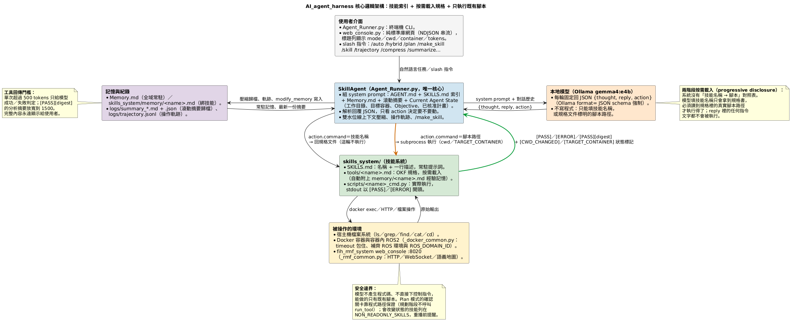
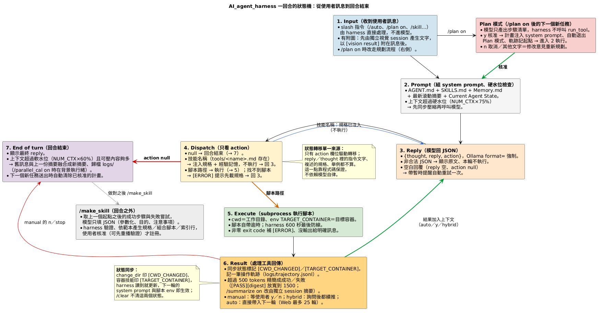

# AI_agent_harness

一個以本地 Ollama 模型（預設 `gemma4:e4b`）為核心的 CLI / Web 機器人維運助理。核心想法是**模型不寫程式、只挑技能**：可用能力拆成一份輕量索引加一批獨立的規格文件與既有腳本，模型在真正需要時才載入該技能的完整說明，再依規格標明的腳本路徑執行。目前的操作對象包含宿主機檔案系統、Docker 容器與容器內的 ROS2，以及 fih_rmf_system 的任務調度 web_console（發送／查詢／取消 work package、語義地圖）。

> 本文件描述目前的實作現況（2026-09），已修正的歷史問題不再贅述；未解決的限制與方向集中在第 6、7 節。架構圖與狀態機圖的來源在 `doc/*.puml`，用 `python3 doc/流程圖產生器.py` 重新產生。

---

## 0. 一頁總覽

**一句話**：使用者用自然語言下指令 → 模型每輪回一個 JSON `{thought, reply, action}` → harness 只看 `action`：填技能名稱就把該技能的規格文件塞回上下文（這輪不執行），填規格裡標明的腳本路徑才真的執行 → 腳本的 stdout（`[PASS]`／`[ERROR]` 開頭）回給模型 → 直到模型不再需要工具。所有能力都是 `skills_system/scripts/` 裡的既有腳本。

| 檔案 | 角色 |
|---|---|
| `Agent_Runner.py` | 唯一的核心：`SkillAgent`（對話狀態、規格載入、腳本執行、上下文壓縮、操作軌跡、`/make_skill`）＋ CLI |
| `web_console.py` | 網頁介面，重用 `SkillAgent`；標題列顯示 mode、cwd、目標容器、tokens |
| `AGENT.md` | 系統提示詞主體：角色、JSON 回覆格式、兩階段執行協議、安全原則、記憶協議（約 2100 tokens 預算） |
| `skills_system/SKILLS.md` | 技能索引（永遠在提示詞裡）；`tools/<name>.md` 規格按需載入；`scripts/<name>_cmd.py` 實際執行 |
| `Memory.md`／`skills_system/memory/` | 全域常駐記憶／綁定技能的經驗記憶（`modify_memory` 寫入） |
| `logs/` | 滾動摘要歸檔、操作軌跡 `trajectory.jsonl`、`/make_skill` 稽核（已 `.gitignore`） |
| `doc/` | 本文件用的兩張 PlantUML 圖與產生器 |

**技能分四群**（第 3 節）：檔案系統；容器與 ROS2（共用 `_docker_common.py`）；調度系統（五個 `workpackage_*`／`overpending_cancel`／`semantic_map`，共用 `_rmf_common.py`）；多模態與記憶。`/make_skill` 可把做對的步驟序列編譯成組合技能（`_composite.py`）。

**harness 替模型維護的狀態**（system prompt 的 Current Agent State）：工作目錄與目標容器，都由腳本輸出的狀態標記同步，`/clear` 不清。

**上下文管理**：單次工具回傳超過 500 tokens 只給模型「成功／失敗」（`[PASS][digest]` 開頭的分析型輸出放寬到 1500）；整體上下文超過軟水位在回合結束後壓成滾動摘要、超過硬水位在呼叫模型前壓。

---

## 1. 架構圖與一回合的流程



上圖是元件與資料流：使用者介面只負責互動；`SkillAgent` 組提示詞、解析回覆、派發執行；模型只產出 JSON；技能系統分索引、規格、腳本三層；腳本去碰真正的環境，並以 `[PASS]`／`[ERROR]` 與狀態標記回報；記憶與紀錄在最外圈。



上圖是一回合內的狀態轉移：1 收訊息 → 2 組提示詞（硬水位檢查）→ 3 模型回 JSON → 4 只看 `action` 分派：`null` 結束、技能名稱注入規格後回到 3、腳本路徑進入 5 執行 → 6 處理結果（同步狀態、記軌跡、門檻精簡、manual／hybrid／auto 決策）→ 回到 3 或結束 → 7 回合結束後做軟水位壓縮。Plan 模式與 `/make_skill` 掛在主流程旁邊，前者在核准後才進入 2，後者從軌跡取材、不在回合之內。

---

## 2. 核心機制

### 2.1 兩種操作介面，共用同一顆大腦

- **`Agent_Runner.py`**：終端機互動介面（`SkillAgent` 類別 + `main()` REPL）。對話狀態、技能載入、腳本執行、壓縮、token 門檻都定義在這裡，是整個專案**唯一的核心來源**。
- **`web_console.py`**：純標準庫（無 Flask／FastAPI）的網頁版，`import` `SkillAgent` 與共用函式，把同一套推理迴圈改寫成「每次 HTTP 請求處理一小段、以 NDJSON 串流逐筆回傳事件」：後端每完成一次推論或工具執行就立刻推一筆，前端邊收邊渲染；本身**不重新定義任何核心規則**。

兩者只差在互動方式（終端機 vs. 兩欄式網頁），推理與工具執行邏輯完全一致。

### 2.2 回覆協議：固定 JSON，只有 `action` 會被執行

模型每一次回覆都是 `{"thought", "reply", "action"}`，由 `ask_ai()` 以 Ollama `format=AGENT_REPLY_SCHEMA` 強制結構。`reply` 是給人看的文字；`action` 是 `null` 或 `{"command": 技能名稱｜腳本路徑, "args": 參數字串}`。`parse_agent_reply()` 解析後，CLI 與 Web 顯示 `reply`（💭 thought 另外顯示，有 action 時附一行「▶ action」），`run_tool()` **只看 `action`**——`reply` 裡不論寫了什麼（解釋時抄的 `EXECUTE:` 範例、複述的整份規格）都不會被執行，「一次只做一步」也由單一 `action` 欄位天然保證。

- **非合法 JSON**：降級為顯示原文、該輪不執行，不退回文字比對。
- **空白回覆**（合法 JSON 但 `reply` 空、`action` `null`）：典型原因是模型在字串裡寫了英文雙引號，JSON 文法被迫提早結束。`ask_ai()` 帶著暫時提醒（不進歷史）自動重試一次；`AGENT.md` 要求 thought 精簡、thought／reply 不用英文雙引號。
- **兩階段完成率**：載入規格後回給模型的訊息是明確的下一步指令（「這一輪只是載入規格，下一輪直接依規格繼續任務，不要解釋、不要反問」），避免小模型停下來聊天。
- `args` 刻意是字串：所有腳本都吃位置參數，規格裡 `EXECUTE: <路徑> <參數>` 的範例就對應 `command`＋`args`，含空白的參數用 `\"` 包住。

### 2.3 技能系統：索引 + 按需載入的規格 + 既有腳本

- **`skills_system/SKILLS.md`**：輕量索引，每個技能一行「名稱 + 描述」，永遠在系統提示詞裡；開頭另有共同慣例（`[PASS]`／`[ERROR]`、逾時、目標容器）。
- **`skills_system/tools/<name>.md`**：每個技能一份 OKF 規格（用途、語法、範例、回傳、異常），只在被用到時載入。若有 `skills_system/memory/<name>.md`（`modify_memory --skill` 寫入的經驗記憶），`_load_skill_doc()` 自動附在規格後面的「# 經驗記憶」區塊。
- **`skills_system/scripts/<name>_cmd.py`**：實際執行的腳本。容器類共用 `_docker_common.py`、工作包類共用 `_rmf_common.py`、組合技能共用 `_composite.py`。

**兩階段派發（progressive disclosure）**：`run_tool()` 拿到 `action` 後，`command` 若對應到存在的 `tools/<name>.md`，就把整份規格（含經驗記憶）當系統回傳注入上下文、不執行；否則把 `command` 當腳本路徑執行。**沒有任何「技能名稱 → 腳本」對照表**，模型必須先讀規格拿到真實路徑才執行得了；猜錯檔名會收到可行動的 `[ERROR]`（檔名若含某個技能名稱，直接提示先載入該技能）。歷史訊息保存模型原始 JSON；壓縮摘要只取 `reply` 與 `[action]`，`thought` 不進摘要。

**手動載入**：Web Console 在輸入框打「/」的選單裡點技能（或 `/skill <名稱>`，CLI 同名指令），`manual_skill_block()` 產生的規格區塊（以 `[skill loaded]` 開頭）會附在下一則訊息後一起送出，省掉一輪「先載規格」；技能清單來自 `list_skills()` 解析 `SKILLS.md`。

**回傳慣例與逾時**：腳本一律由 stdout 回傳，成功以 `[PASS]` 開頭，失敗（含逾時）以 `[ERROR]` 開頭並附原因與建議——`_content_for_context()` 靠這個前綴判定成功／失敗。以 `[PASS][digest]` 開頭代表「已為模型整理過的分析摘要」（`workpackage_status --watch`、`semantic_map`、`ROS2_topic_echo --duration`），門檻放寬到 `DIGEST_TOKEN_THRESHOLD`（1500 tokens），CLI／Web 不標 ⚠️。每支會呼叫外部程序或網路的腳本都有自己的逾時上限（寫在規格裡），`run_tool` 另設 `TOOL_EXEC_TIMEOUT`（600 秒）當最後防線，腳本以非零 exit code 結束時補 `[ERROR]` 前綴、完全沒有輸出時給出明確訊息。

### 2.4 harness 替模型維護的狀態：工作目錄與目標容器

兩者機制相同：狀態放在 `SkillAgent`（`current_cwd`、`target_container`），顯示在 system prompt 的 Current Agent State 與 Web 標題列，執行腳本時傳給腳本（cwd／環境變數 `TARGET_CONTAINER`），腳本成功改變狀態時在輸出印一行標記，`_sync_state_from_tool_output()` 讀到就更新。`/clear` 不清這兩個狀態。

- **工作目錄**：`change_dir` 印 `[CWD_CHANGED] 路徑`；之後所有腳本以它為 cwd，相對路徑自然生效。
- **目標容器**：預設空。容器技能（`docker_runcmd`、`ROS2_*`）省略 `<container_name>` 時由 `_docker_common.resolve_container()` 取目標容器，沒有就回 `[ERROR]` 提示先 `docker_containers` 查、`docker_open` 選定；腳本成功操作某容器後在輸出末行印 `[TARGET_CONTAINER] <名稱>`（放末行是為了不破壞 `[PASS]`／`[PASS][digest]` 的開頭判定，與目前目標相同時不印）。所以目標容器＝最近一次成功操作的容器，`docker_open`／`docker_est` 是刻意選定或切換用。`AGENT.md` 要求模型直接用它、不再反問使用者要看哪個容器；`docker_runcmd` 只有一個參數時整串是指令、有目標且第一個參數不是任何現有容器的完整名稱時也把整串當指令（模型常忘記引號或省略名稱）；`ROS2_topic_echo`／`ROS2_node_info` 以 `/` 開頭的第一個參數判定為 topic／node、容器省略。組合技能重播與軌跡記錄也帶著它（`_composite._sync_state`）。

### 2.5 上下文管理：真實 token 尺度、雙水位線、滾動融合摘要

**Token 計量**：Ollama 沒有 tokenize API，所以 AI 回覆用 `eval_count`、整體上下文用 `prompt_eval_count`（精確），使用者輸入與工具回傳用「字元數 ÷ `chars_per_token`」估算，`chars_per_token` 每次呼叫後以 `prompt_eval_count` 重新校準（中文為主約 1.8～1.9）。所有門檻與 `num_ctx` 同一尺度；Web 標題列的 `ctx` 前有 `≈` 代表估算值。

| 常數 | 值 | 作用 |
| :--- | :--- | :--- |
| `NUM_CTX` | 32768（`AGENT_NUM_CTX`） | 每次請求給 Ollama 的 context 上限，主對話、壓縮摘要、工具摘要三種 session 共用；記憶體小的設備可設回 12288 |
| `TOKEN_THRESHOLD`（硬水位） | `NUM_CTX × 75%`（`AGENT_HARD_RATIO`） | `ask_ai()` 呼叫前若超過，一定**同步**壓縮（`ensure_context_budget()`），確保壓縮先於 Ollama 在 `num_ctx` 處的靜默截斷；背景壓縮進行中則先等它完成 |
| `SOFT_TOKEN_THRESHOLD`（軟水位） | `NUM_CTX × 60%`（`AGENT_SOFT_RATIO`） | 只在**回合結束後**檢查（`after_turn_compression()`）：答案已送出、模型閒著，切點落在任務邊界；`/parallel_cal on` 時在背景執行緒做 |
| `MIN_COMPRESS_TOKENS` | `max(1000, NUM_CTX ÷ 20)` | 軟水位的「值不值得」門檻：可壓的舊內容太少就不花一次模型呼叫 |
| `KEEP_RECENT_TOKENS` | `NUM_CTX × 15%` | 壓縮時保留最新這麼多 token 的原文，在訊息邊界切、不拆開指令與其 `[tool result]`（`_split_for_compression()`） |
| `SUMMARY_MAX_CHARS` / `SUMMARY_MAX_PREDICT` | 600 字 / 2000 tokens | 融合摘要的長度目標（實測會超過約三成）與 `num_predict` 硬上限；被截斷時 JSON 解析失敗退回原文 |
| `SUMMARY_ARCHIVE_KEEP` | 30（`AGENT_SUMMARY_KEEP`） | `logs/` 只保留最近 N 份 `summary_*.md` 與同名 `.json` |
| `SUMMARY_MODEL` | 同主模型（`AGENT_SUMMARY_MODEL`） | 壓縮摘要與工具摘要用的模型；與主模型不同時背景壓縮才真的平行 |
| `TOOL_RESULT_TOKEN_THRESHOLD` / `DIGEST_TOKEN_THRESHOLD` | 500 / 1500 | 單次工具回傳超過就改成「成功／失敗」判定（或 `/summarize on` 的獨立 session 摘要）；規格文件與 `[PASS][digest]` 例外。完整內容仍顯示給使用者並標 ⚠️ |

Web Console 另有 `MAX_AUTO_ITERATIONS = 25`：Auto 模式連續執行工具超過此輪數強制中止本回合。所有 `ollama.chat()` 都帶 `num_ctx=NUM_CTX`（不帶時 Ollama 預設 4096 會在背後悄悄截斷）。

**滾動融合摘要**：`compress_context_to_file()` 切出保留區以外的舊訊息交給 `summarize_messages()`，摘要模型同時收到上一份 `rolling_summary` 與新片段（渲染成 `[user]`／`[assistant]`／`[harness …]` 純文字），輸出一份更新後的完整摘要取代上一份；結構由 `format=SUMMARY_SCHEMA`（overview／key_progress／results_and_errors／user_preferences／open_items）強制，`_render_summary_markdown()` 排成固定五段。每次壓縮寫 `logs/summary_<時間>.md` 與同名 `.json`，但 system prompt 只注入最新一份；啟動時從 `logs/` 最新一份載入，摘要跨 session 延續，`/clear` 不清，要完全重來請刪 `logs/`。以 `HARNESS_MARKERS`（`[tool result]`、`[vision result]`、`[skill loaded]`、`[PLAN_REQUEST]`…）開頭的訊息會被標成框架訊息，避免被記成使用者偏好。

**system prompt 成本**：`AGENT.md` 約 2100、`SKILLS.md` 約 900、`Memory.md` 依內容、滾動摘要約 500 tokens，每輪常駐。`AGENT.md` 刻意維持重複強調的詳細寫法（精簡版 A/B 實測會讓 4B 模型猜腳本檔名），新規則要精簡，技能專屬的引導放進 `tools/<name>.md`。

**`/parallel_cal on|off`（背景壓縮，預設關閉，`AGENT_PARALLEL_CAL=1` 改預設）**：軟水位壓縮改由 `start_background_compression()` 在背景執行緒進行，完成後 `_apply_compression()` 以物件身分把那幾則從 `messages` 原地移除，期間新加入的訊息不會遺失；通知放進 `pop_notices()`（CLI 下一次輸入後印出、Web 隨 stats 推送並每 4 秒輪詢）。**前提**：Ollama 要為模型配置 2 個以上 slot，或摘要模型與主模型不同——實測 Ollama 0.34 對多模態模型（gemma4）強制單 slot，同模型開背景壓縮時下一次對話會在 Ollama 內排隊；搭配 `AGENT_SUMMARY_MODEL=gemma4:26b` 之類的不同模型才有真正的平行，代價是第二個模型的記憶體與算力。算力弱的設備建議維持關閉。

**`/summarize on|off`（工具回傳摘要模式，預設關閉）**：超過門檻的工具回傳改由 `summarize_tool_result()` 開一個獨立、乾淨的一次性 session 做語意摘要（拿「使用者原始問題」當聚焦依據：Objective → 目前計畫步驟 → 本輪任務文字），主 session 拿到重點而不只是成功／失敗；摘要失敗自動退回判定。Web 以紫色「🧠 AI 摘要（獨立 session）」卡片顯示。代價是多一次模型呼叫。

**訊息則數視窗停用**：`SkillAgent(max_history=None)` 是預設，上下文大小只由 token 門檻決定，舊內容一律摘要歸檔而不是無聲丟棄；`max_history` 只保留為可選保險絲。

### 2.6 三種執行模式

- **Manual（預設）**：每次工具執行完都要人工確認是否把結果加入上下文（y／n／stop）。
- **Hybrid**（`/hybrid on`）：一樣詢問，但不論加入或捨棄都讓 AI 接續推論。
- **Auto**（`/auto on`）：工具結果自動帶入下一輪，直到沒有工具需要執行（Web 上限 25 輪）。

### 2.7 記憶

- **全域記憶 `Memory.md`**：只有使用者明確要求（「記住這件事」等）才由 `modify_memory` 寫入，格式 `[問題種類] | [問題描述] | [解決方法或結論]`；`load_long_term_memory()` 每輪把最近 30 行放進系統提示詞。
- **技能綁定記憶 `skills_system/memory/<name>.md`**：`modify_memory --skill <技能>` 寫入，只在該技能規格被載入時一起進入上下文，平常不佔 token。判斷規則在 `AGENT.md`：某技能的用法、參數、前置條件、曾發生的錯誤綁技能；通用原則、技能取捨、溝通風格、專案經驗寫全域。腳本拒絕不存在的技能名稱與 `--skill modify_memory`、略過重複內容、單一技能超過 10 則或約 800 字時提醒整併；檔案路徑由腳本自身位置推算，不受工作目錄影響。
- **滾動摘要**（`logs/summary_*.md` + `.json`）：見 2.5。
- **Sticky Objective**：`objective set|show|clear`（Web 為 `/objective set <內容>`），持續出現在系統提示詞裡直到清除。

### 2.8 Plan 模式：先規劃、經使用者核准才執行

`/plan on|off`。開啟後**下一個**新任務不直接執行，而是：

1. `build_plan_request()` 把任務包成「請依 `SKILLS.md` 規劃步驟、這輪不要執行」的請求（`[PLAN_REQUEST]`；修改意見為 `[PLAN_REVISION]`）。
2. 模型回步驟清單，使用者 `y` 核准／`n` 取消／其他文字＝修改意見重新規劃（CLI 用 `input()` 迴圈 `_run_plan_flow()`；Web 是「📝 有計畫待你核准」提示列＋按鈕，也可直接打字）。
3. **安全設計**：規劃階段從頭到尾不呼叫 `run_tool()`，確認關卡由程式路徑保證；模型在規劃回覆裡填了 `action` 也不會被執行，計畫文字取 `reply`。
4. 核准後計畫存進 `current_plan`，由 `_build_plan_context_prompt()` 注入每一次的系統提示詞，不會被壓縮沖掉；**核准同時自動退出 Plan 模式**，取消或修改意見則維持。
5. **計畫的生命週期＝那個任務的執行期間**：工具決策、auto 迴圈、自動壓縮都不清它；使用者送出下一個新任務時自動清除（`/plan done` 可提早清、`/clear` 也清）。取捨：AI 中途問你問題、你打字回答，這句也算新任務而清掉計畫，AI 仍能從歷史看到計畫內容。

### 2.9 多模態影像：`vision/` library 與 📷 附圖

影像邏輯集中在頂層套件 `vision/`，三個使用者共用：Web Console 的 📷 附圖、`subagent/screen_gemma4_web.py`（框選截圖 → 推論的單頁工具）、`image_inspect` 技能。

- `vision/capture.py`：伺服器端螢幕擷取，WSL → PowerShell、Linux X11 → Pillow `ImageGrab` + `xrandr`；都沒有時前端改用瀏覽器的 `getDisplayMedia`（頁面需以 `http://localhost` 或 https 開啟）。裁切在瀏覽器端以原始解析度完成。
- `vision/images.py`：檔案、bytes、data URL、截圖裁切統一成 `PIL.Image`。
- `vision/inference.py`：`analyze(images, prompt)` 呼叫多模態模型（`VISION_MODEL`、`VISION_TIMEOUT` 可調），失敗一律 `VisionError`。
- `vision/session.py`：`VisionSession`，螢幕選單 → 擷取 → 框選裁切 → 影像清單的工作階段。
- `vision/web/`：前端共用的框選覆蓋層與螢幕選單（`snip.js`／`snip.css`）。

**附圖如何進入主對話**：獨立視覺 sub-session——影像加使用者訊息先交給 `analyze()`（要求直接回答問題並逐字抄錄相關文字、數值、錯誤訊息），結果以【系統影像分析】區塊（`[vision result]`）附在使用者訊息後再進入 `run_turn()`。主對話永遠是純文字，壓縮與 token 計量不需知道影像存在；代價是主 Agent 看到的是描述，追問需重新附圖。與影像有關的稱呼只在真的附圖時才出現在上下文（曾寫進 `AGENT.md` 導致模型在純文字對話裡也說「影像分析結果」）。視覺分析不套用工具回傳門檻，超過時卡片標 ⚠️。影像只在送出一次新任務時消費。

### 2.10 自建技能：`/make_skill` 把做對的操作軌跡編譯成組合技能

把一件事做對之後（不論是否用 Plan 模式），輸入 `/make_skill <技能名稱>` 就能把這段正確路徑變成可重複使用的技能。編譯刻意做成 harness 的功能而不是交給 4B 模型：**harness 記錄軌跡、挑步驟、驗證、用範本產生檔案、寫入索引；模型只填一份 JSON；使用者在預覽後核准**。

1. **操作軌跡**（`SkillAgent.trajectory` + `logs/trajectory.jsonl`）：`run_tool` 每執行一支腳本記一筆——指令、參數、當時的工作目錄／容器目錄／目標容器、成功或失敗、輸出開頭 300 字、當時的任務敘述。載入規格與猜錯檔名不算步驟；軌跡在 `messages` 之外，壓縮不會沖掉。起點（`kind="boundary"`）：`/clear`、計畫核准、每次 `make_skill` 註冊完成。`/trajectory` 列出全部步驟。
2. **挑步驟**：預設取「上一個起點之後」，也可 `all`、`3-7`、`3,5,8`。`_group_trajectory()` 把每個成功步驟與它之前的失敗嘗試配成一組（供模型歸納注意事項），最後仍未修正的失敗不成為步驟。
3. **模型填表**（`draft_skill_from_trajectory()`）：獨立一次性 session，`format=MAKE_SKILL_SCHEMA`：標題、索引描述、分類、用途、參數（之後會變的值，example 必須是軌跡原值）、每步的 include／目的／參數化 args、成功判準、注意事項。模型由 `AGENT_SKILL_MODEL` 指定（預設同摘要模型）。
4. **驗證**（`_normalize_skill_draft()`）：參數化必須「代回 example 後與實際參數逐字相同」；模型宣告了參數卻照抄原值時，系統依 example 自動代入佔位符（整個相同直接換，長度 ≥3 的值允許詞邊界子字串替換）並在預覽註明；分類不存在放「自建技能」；沒用到的參數移除；步驟只能排除、不能重排或新增。
5. **範本產生三個檔案**（先到 `skills_system/drafts/<名稱>/`）：OKF 規格 `tools/<名稱>.md`；資料型腳本 `scripts/<名稱>_cmd.py`（只有 `NAME / PARAMS / STEPS`，執行邏輯全在 `_composite.py`：依序 subprocess 執行既有腳本、代入 `{參數}`、任一步 `[ERROR]` 即停、`[CWD_CHANGED]`／`[TARGET_CONTAINER]` 帶到下一步並保留在總輸出、單步 300 秒／合計 570 秒）；`SKILLS.md` 索引行。
6. **核准流程**：CLI（`_run_make_skill_flow()`）與 Web（`handle_skill_draft_response()`）共用狀態機 `start/revise/approve/cancel_skill_draft`。預覽後 `y` 註冊；`t` 先**重播驗證**（用 example 原值實際跑一次，`[PASS]` 才註冊）；`n` 取消；其他文字＝修改意見重擬。含 `NON_READONLY_SKILLS`（`docker_est`、`docker_open`、`change_dir`、`modify_memory`、`workpackage_send`、`workpackage_cancel`、`overpending_cancel`）時預覽提醒重播是真的執行。註冊後下一次呼叫就看得到新技能。
7. **引導建議**：優先用 Plan 模式（起點自動、軌跡乾淨）；會變的值引導時用真實值、做技能時說明哪些要參數化；一個技能只做一件事；只有一步的做對經驗請用 `modify_memory --skill` 寫記憶。**第二階段**（需要新程式碼的能力）尚未實作，見 7.2。

---

## 3. 技能清單（全部功能）

規格文件在 `skills_system/tools/`，腳本在 `skills_system/scripts/`；模型看到的一行描述在 `SKILLS.md`。

### 3.1 檔案系統（宿主機，以工作目錄為 cwd）

| 技能 | 做什麼 | 腳本 | 重點 |
| :--- | :--- | :--- | :--- |
| `list_dir` | 列出目錄清單 | `ls_cmd.py` | |
| `search_text` | 在檔案內容中 grep 關鍵字 | `grep_cmd.py` | `AGENT.md` 禁止對 `/` 遞迴搜尋，範圍限制在工作目錄或子目錄 |
| `find_file` | 只搜尋檔名 | `find_file_cmd.py` | |
| `change_dir` | 切換工作目錄 | `cd_cmd.py` | 印 `[CWD_CHANGED]` 讓 harness 同步（2.4） |
| `view_file` | 查看檔案內容 | `cat_cmd.py` | 技能規格不用它，`action.command` 填技能名稱即載入 |

### 3.2 容器與 ROS2（共用 `_docker_common.py`）

| 技能 | 做什麼 | 腳本 | 重點 |
| :--- | :--- | :--- | :--- |
| `docker_containers` | 列容器（可 `--running`、關鍵字） | `docker_containers_cmd.py` | 沒有目標容器且多個在跑時，請使用者指定、不自行挑 |
| `docker_images` | 列映像檔 | `docker_images_cmd.py` | |
| `docker_est` | 以映像檔建容器並常駐（`tail -f /dev/null`） | `docker_est_cmd.py` | 新容器成為目標容器 |
| `docker_open` | 選定目標容器並驗證連線 | `docker_open_cmd.py` | 部分名稱唯一符合即可，多個符合列候選；末行 `[TARGET_CONTAINER]` |
| `docker_runcmd` | 容器內執行 shell 指令 | `docker_runcmd_cmd.py` | `[--timeout 秒]`（1～570）`[容器] "指令"`，容器可省略 |
| `ROS2_topic_list` / `ROS2_node_list` | 列 topic／node | `ROS2_topic_list_cmd.py`、`ROS2_node_list_cmd.py` | `[容器]` 可省略 |
| `ROS2_topic_echo` | 讀一筆訊息，或 `--duration 秒`（2～300）擷取一段時間 | `ROS2_topic_echo_cmd.py` | 一段時間模式回 `[PASS][digest]`：則數、頻率、首尾原文、每個欄位的數值範圍／字串種類／固定不變清單（PyYAML 攤平，String 內的 JSON 也解開） |
| `ROS2_node_info` | node 詳細資訊 | `ROS2_node_info_cmd.py` | `[容器] <node>`，node 以 `/` 開頭 |

共通：在容器內以 coreutils `timeout` 包住指令，逾時真的終止容器內程序而不是只殺宿主機端的 `docker exec`；常見 docker／ros2 錯誤翻成可行動的說明；ROS2 指令用 `bash -ic` 並由 `ROS2_ENV_FALLBACK` 補齊環境——shell 沒有 `ros2` 就 source `/opt/ros/<distro>`，再靜默 source 第一個找到的 colcon overlay，shell 沒有 `ROS_DOMAIN_ID` 時從容器內正在跑的 ROS 節點的 `/proc/<pid>/environ` 複製 domain／RMW／CycloneDDS／discovery 變數（fih_rmf_system 的節點跑在 domain 98，不補齊會看到空的 topic 列表）。

### 3.3 調度系統（fih_rmf_system 的 web_console，共用 `_rmf_common.py`）

五個技能對齊 `distribute_task.FastAPIBridgeNode` 的對外能力，全部走 `http://localhost:8020`（容器 `network_mode: host`；`--url` 或環境變數 `RMF_WEB_CONSOLE_URL` 可改）。技能**不讀任何地圖檔**，站點、語意、機器人位置都問 web_console，所以看到的永遠是它目前載入的場域。

| 技能 | 做什麼 | 對應端點 | 重點 |
| :--- | :--- | :--- | :--- |
| `workpackage_send` | 發送多站點 work package | `POST /api/send_tasks` → `incoming_work_packages` | 站點可寫代號或語意名稱（「加工線通道-6」→ a0，對不到或對到多站回 `[ERROR]`）；`--loop` 不接數字＝無限循環（orchestrtor `loop_count` None，也收 `--loop 0`／`無限`／`--forever`）、`--loop N`＝N 輪、不加＝一輪；`--amr`／`--type`／`--level`／`--weight`／`--desc`；回傳第一行寫出站數、循環、機器人；`--ros2 [容器]` 備用入口不經 web_console 直接 `ros2 topic pub`（容器省略＝目標容器）；帶了別的技能的選項會直接指路 |
| `workpackage_status` | 執行狀態：一幀或 `--watch 秒`（1～300） | WebSocket `/api/ws` | 一幀：每個 work package 一行（狀態、第幾站含語意名稱、工作項、機器人或 ⏳、循環進度）、distribute 佇列（raw／processing／OverPending）、機器人、最近事件；`--watch` 回 `[PASS][digest]`：站點推進、OverPending 進出、機器人狀態變化、新增事件與結束摘要 |
| `workpackage_cancel` | 取消一個 work package | `DELETE /api/work_packages/{id}` | 送出後讀一幀確認；只停止派下一站，當前站可能仍執行完 |
| `overpending_cancel` | 刪除卡在 OverPending 逾時區的單站任務 | `DELETE /api/overpending_tasks/{id}` | OverPending 會來回：raw 等超過 `threshold_ovp_sec` 才進、再過 `threshold_recovery_sec` 又回流，DELETE 只對此刻在逾時區的任務有效；不在時回報所在佇列（不是錯誤），`--wait 秒` 等它進來再刪 |
| `semantic_map` | 語義地圖與目前佈局 | `GET /api/topology` + 一幀快照 | 站點代號、semantics.yaml 的語意名稱與說明（VLM 判讀紀錄）、座標、路段；把機器人座標／`target_id`／`current_edge`（RobotState 用節點 id，會換成代號）與 work package 當前站對到每站；帶關鍵字看單站詳情；`--stations`／`--robots` 只列清單 |

`_rmf_common.py` 提供 HTTP、純標準庫的迷你 WebSocket 客戶端、拓譜圖與站點對應、快照查詢、`--url` 共用選項。`scripts/mock_server.py` 是純標準庫的 web_console 替身，模擬上述全部端點（持續推幀的 WebSocket、拓譜圖、每 8 秒在 raw／OverPending 間來回的示範任務），離線測試用 `--port 8021` 啟動並以 `--url` 指過去。

### 3.4 多模態與記憶

| 技能 | 做什麼 | 腳本 | 重點 |
| :--- | :--- | :--- | :--- |
| `image_inspect` | 對影像檔依提示詞做視覺模型分析 | `image_inspect_cmd.py` | 走 `vision.analyze()`（2.9） |
| `stt_engine` | 錄音 10 秒並以 Whisper 辨識 | `stt_engine_cmd.py` | 綁死作者環境，見 6 |
| `modify_memory` | 寫入經驗記憶（全域或 `--skill`） | `modify_memory_cmd.py` | 見 2.7 |

### 3.5 組合技能（`/make_skill` 產生）

資料型腳本 + `_composite.py`，見 2.10；註冊後與其他技能無異，依索引描述被選到、載規格、執行。

---

## 4. 目錄結構

```
AI_agent_harness/
├── Agent_Runner.py          # 核心：SkillAgent 類別 + CLI REPL（唯一的核心邏輯來源）
├── web_console.py           # Web 版介面，重用 Agent_Runner 的邏輯
├── AGENT.md                 # 系統提示詞主體：角色、JSON 回覆格式、執行協議、安全原則、記憶協議
├── Memory.md                # 全域長期記憶（modify_memory 不加 --skill 時寫入，每輪常駐）
├── logs/                    # 滾動摘要歸檔（.md + .json，只留最近 30 份）、trajectory.jsonl、make_skill 稽核；已 .gitignore
├── doc/
│   ├── AI_agent_harness的說明.puml      # 架構圖來源
│   ├── AI_agent_harness的狀態轉移.puml  # 一回合狀態機來源
│   ├── 流程圖產生器.py                   # 透過 PlantUML 伺服器把 doc/*.puml 轉成 images/*.png
│   └── images/*.png                     # README 引用的圖
├── skills_system/
│   ├── SKILLS.md             # 技能輕量索引（/make_skill 註冊的技能也寫在這裡）
│   ├── tools/<name>.md       # 各技能的 OKF 規格文件（按需載入）
│   ├── memory/<name>.md      # 技能綁定的經驗記憶（modify_memory --skill 寫入）
│   ├── drafts/<name>/        # /make_skill 尚未核准的草稿（暫時檔，已 .gitignore）
│   └── scripts/
│       ├── <name>_cmd.py     # 各技能實際執行的腳本
│       ├── _docker_common.py # 容器類共用：逾時、錯誤翻譯、ROS2 環境補齊、目標容器
│       ├── _rmf_common.py    # 工作包類共用：HTTP、WebSocket、語義地圖、快照
│       ├── _composite.py     # 組合技能的執行器
│       └── mock_server.py    # fih_rmf_system web_console 的離線替身
├── vision/                   # 多模態影像 library：擷取／影像處理／推論／工作階段／前端框選資源（2.9）
└── subagent/                 # 獨立的框選截圖 → 視覺推論單頁工具（vision library 的薄殼）
```

---

## 5. 執行方式

### 5.1 前置需求

- 已安裝並執行中的 [Ollama](https://ollama.com/)，且已 `ollama pull` 對應模型（預設 `gemma4:e4b`）。
- Python 3.10+ 與 `ollama` Python 套件（`pip install ollama`）。Web Console 本身純標準庫。
- 多模態影像功能需要 `Pillow`。伺服器端截圖支援 WSL（PowerShell）與 Linux X11（Pillow 需有 xcb、有 `xrandr`）；其他環境改用瀏覽器的分享畫面，頁面需以 `http://localhost` 或 https 開啟。
- 容器與 ROS2 技能需要宿主機的 `docker` CLI；`ROS2_topic_echo --duration` 的欄位統計需要 `PyYAML`（沒有時退回粗略統計）。
- 調度系統技能需要 fih_rmf_system 的 web_console 在 8020（或用 `mock_server.py`）。
- 重新產生文件圖需要網路：`doc/流程圖產生器.py` 純標準庫，把 `doc/*.puml` 編碼後向 PlantUML 官方伺服器（https）取 PNG，不需要本機 Java／Graphviz。

### 5.2 CLI

```bash
python3 Agent_Runner.py
```

指令：`/clear`、`/compress`、`/auto on|off`、`/hybrid on|off`、`/summarize on|off`、`/parallel_cal on|off`、`/plan on|off|done`、`/skills`、`/skill <名稱>`、`/trajectory`、`/make_skill <名稱> [範圍]`、`objective set|show|clear`（`set` 為多行輸入，到 `objective end` 為止）、`exit`／`quit`。

### 5.3 Web Console

```bash
python3 web_console.py
```

預設監聽 `http://127.0.0.1:8765`（只綁本機）。畫面左欄「使用者 ↔ Agent 對話」、右欄「系統 / 工具回傳」（規格載入、腳本結果、💭 thought、系統通知、🧠 AI 摘要、🖼️ 視覺分析卡片）。輸入框打「/」彈出選單（上半指令、下半 `SKILLS.md` 技能，選技能等同 `/skill`），`/menu` 列出全部指令與說明。Manual／Hybrid 模式下工具執行後出現決策按鈕；Plan 模式出現核准／取消按鈕；`/make_skill` 出現核准／重播驗證／取消按鈕；📷 可框選畫面或選檔附圖。標題列：mode、cwd、container（目標容器）、tokens 與 ctx 水位。後端端點：`POST /api/send`、`POST /api/decision`、`GET /api/status`、`GET /api/commands`、`/api/skill/*`、`/api/vision/*`。

| 環境變數 | 預設值 | 說明 |
| :--- | :--- | :--- |
| `WEB_CONSOLE_MODEL` | `gemma4:e4b` | Web 版使用的模型（CLI 的模型名稱寫在 `Agent_Runner.py` 的 `main()`） |
| `WEB_CONSOLE_HOST` / `WEB_CONSOLE_PORT` | `127.0.0.1` / `8765` | 綁定位址與埠 |
| `AGENT_NUM_CTX` | `32768` | Ollama context 上限，各水位是它的比例（CLI 亦適用） |
| `AGENT_HARD_RATIO` / `AGENT_SOFT_RATIO` | `0.75` / `0.60` | 硬／軟水位比例 |
| `AGENT_SUMMARY_KEEP` | `30` | `logs/` 保留的摘要歸檔份數 |
| `AGENT_SUMMARY_MODEL` | 同主模型 | 壓縮摘要／工具摘要用的模型 |
| `AGENT_PARALLEL_CAL` | 未設定＝關閉 | `/parallel_cal` 的啟動預設值 |
| `AGENT_SKILL_MODEL` | 同摘要模型 | `/make_skill` 草擬用的模型 |
| `VISION_MODEL` / `VISION_TIMEOUT` | `gemma4:e4b` / `180` | 視覺 sub-session 的模型與逾時秒數 |
| `RMF_WEB_CONSOLE_URL` | `http://localhost:8020` | 調度系統技能的 web_console 位址（各腳本也接受 `--url`） |

### 5.4 離線驗證的做法

專案內沒有正式測試套件（見 6），但每次改動都用同一套方法驗證，接手時可比照：以假的 `ollama.chat`（回固定 JSON）驅動 `SkillAgent`／`web_console` 的流程；技能腳本對 `scripts/mock_server.py`（調度系統）或 PATH 前置的假 `docker`（容器技能）執行；把 `SkillAgent` 的 `script_dir`／`base_path` 等路徑指到暫存副本，避免測試寫進真的 `skills_system/`、`Memory.md`、`logs/trajectory.jsonl`；最後用 `gemma4:e4b` 真模型跑幾句自然語言需求，確認技能選擇與參數（對真系統只做唯讀操作）。

---

## 6. 已知限制

1. **小型本地模型的工具呼叫可靠度**：`gemma4:e4b` 偶爾會不下 `action`、直接「腦補」一份假的執行結果，或在未設目標容器且多個容器在跑時自行挑第一個。Plan 模式的確認關卡與 JSON 協議的「只看 action」消除了誤觸發，但擋不住模型自己編造結果；規格文件只能用文字要求「多個容器時請使用者指定」。
2. **`stt_engine` 綁死特定環境**：麥克風裝置名稱、Windows 路徑（`C:\temp`）、`ffmpeg.exe` 路徑寫死在腳本裡，僅適用作者的 WSL + Windows 錄音裝置。
3. **CLI 與 Web Console 不完全對等**：CLI 的 `objective set` 是多行輸入，Web 簡化成單行 `/objective set <內容>`；CLI 沒有 Auto 模式的輪數上限（有人在終端機前可 Ctrl+C）。
4. **沒有正式測試套件在專案內**：驗證用的 stub 腳本留在開發者的暫存目錄（做法見 5.4），尚未整理成 `tests/`。
5. **使用者輸入與工具回傳的 token 數是估算值**：只有 AI 回覆與整體上下文精確；夾雜大量程式碼或 URL 的內容誤差較大。`count_tokens()` 保留對 `ollama.tokenize()` 的偵測，日後套件提供時自動改用。
6. **背景壓縮是否真的平行取決於 Ollama 的 slot**：多模態模型目前被強制單 slot，同模型的背景摘要會讓下一次對話排隊；要平行需 `AGENT_SUMMARY_MODEL` 指定另一個模型。API 查不到 slot 數，程式無法自動判斷。
7. **融合摘要的長度只能靠 prompt 約束**：實測會超過目標約三成；`SUMMARY_MAX_PREDICT` 只是防失控的硬上限。
8. **小模型對 `modify_memory --skill` 的判斷不可靠**：該綁技能還是寫全域常判斷錯；框架只把最糟的錯誤（自綁、綁不存在的技能）擋成可恢復的 `[ERROR]`。
9. **`/make_skill` 的草稿品質受模型限制**：哪些值該參數化、索引描述是否讓之後的模型選得到，都是草擬模型的判斷；框架保證「錯不會傳下去」（對不上就退回原值、漏填照原值納入、預覽列出每項修正），最終靠使用者檢查。可用 `AGENT_SKILL_MODEL` 換較大的模型。
10. **JSON 協議下的空白回覆**：模型在字串裡用英文雙引號時會發生，屬機率性；框架自動重試一次並在提示詞禁用英文雙引號，重試仍空白時如實顯示。
11. **組合技能的輸出容易超過工具回傳門檻**：多步驟總輸出常超過 500 tokens，主模型只收到成功／失敗判定（各步輸出仍完整顯示給使用者），需要重點時開 `/summarize on`。重播驗證只驗證會不會 `[PASS]`、不比對內容，且會真的執行有副作用的步驟。
12. **調度系統技能依賴 web_console 的版本**：`semantic_map` 需要 `/api/topology` 端點，舊版 web_console 會回 404；OverPending 的時序常數（`threshold_ovp_sec`、`threshold_recovery_sec`）以 distribute 的設定為準，規格裡的「約 10 秒」是預設值。

---

## 7. 未來方向

### 7.1 讓 AI 自己把檢索範圍縮小

`search_text`／`find_file`／`list_dir` 已是精準檢索的雛形，但大量結果的處理仍是「超過門檻就換成成功／失敗判定」。更根本的做法是在規格文件與 `AGENT.md` 裡要求模型先縮小路徑、關鍵字具體、必要時分批查詢；幾乎零成本，效果依賴模型是否遵守。

### 7.2 自我進化第二階段：需要新程式碼的技能

第一階段（2.10）只支援「既有步驟的序列」。第二階段是讓較大的模型草擬腳本到 `drafts/`，harness 以軌跡中的實際案例當測試 oracle 反覆執行、餵回錯誤讓它修正，通過且經使用者審核後才註冊；也可在 Plan 模式所有步驟完成時主動詢問「要做成技能嗎」，並把修正過程中的失敗嘗試自動寫成該技能的 `memory/<name>.md`。

### 7.3 精準檢索 vs. 獨立 session 摘要，該用哪個不應只看 token 量

目前超過門檻時用哪種降維純粹是全域開關，與內容特性無關。搜尋型技能撈出大量結果時，更好的處理可能是引導模型用更精確的關鍵字重查；長篇日誌則適合語意摘要。可依技能類型（或規格文件的 metadata）決定 `_content_for_context()` 的策略。

### 7.4 `Memory.md` 的內化與整併

技能專屬的記憶已能用 `--skill` 綁到規格旁按需載入。尚未做的是：定期把全域條目重新分類（屬於某技能的搬到 `memory/<name>.md`，屬於規劃原則的內化進 `build_plan_request()`）、內化後刪除原條目，讓常駐的 `Memory.md` 不會無止盡增長。語料已備好：`logs/summary_*.json` 的 `results_and_errors`／`user_preferences`／`open_items` 欄位可供反思機制定期讀取、提議寫入。

### 7.5 補齊測試與可攜性

把 5.4 的驗證做法整理成專案內的 `tests/`（假 `ollama.chat`、`mock_server.py`、假 `docker`），並讓 CLI 的模型名稱也能由環境變數覆寫。

---

## 8. 長期願景（概念性）：AGV/AMR 車隊調度場景延伸

> 以下內容由使用者提供，是一份完整的概念性系統規格文件，描述這個 harness 未來若要往「AGV/AMR 車隊調度決策輔助」場景擴展時的目標架構，**不是目前程式碼已經實作的東西**，也不會逐項對應到現有模組。之所以收錄在這裡，是因為文中的「多 Session 分割摘要（Map-Reduce Summarization）」機制，正是 2.5 節的上下文壓縮與 7.3 節的工具回傳摘要方向的一個具體、更大規模的參照範例：現在的 `compress_context_to_file()` / `summarize_tool_result()` 都是單一 session 的摘要，而這份文件描述的是當語意資料量大到連單一摘要 session 都塞不下時，如何先分塊、平行摘要、再彙整（Map → Reduce）。以下保留原文結構，僅調整標題階層以嵌入本文件。

### 8.1 設計背景與安全邊界 (Safety & Control Boundaries)

在工業自動化與場域安全標準（如 **ISO 3691-4** 與 **VDA 5050**）規範下，底層路徑規劃與車輛控制指令必須具備高實時性與確定性。為避免 LLM 潛在的幻覺（Hallucination）引發實體碰撞或排程混亂，本系統將 AI Agent 定位為「資深調度顧問 / 情態感知輔助系統」。

**核心原則**

* **不直接介入控制**：AI Agent 不直接向底層 Planner 或 AGV 發送修改控制命令。
* **人機協同 (Human-in-the-Loop)**：採用純觀察/預警（Observation Only）與半自動審查模式，由 Agent 輸出情意分析與調度建議，再由 Fleet Admin（管理員）進行最終確認與執行。

### 8.2 系統架構與功能模組 (System Modules)

AI Agent 在調度架構中擔任「場域全知感知與語意轉譯器」，劃分為四大核心模組：

```
[使用者時間排程] ───┐
                   ├──► [Dynamic Context Ingestion]
[VLM 視覺現況]    ───┤      ( GeoJSON + SkillOKF )
                   │                 │
[海量拓撲語意描述] ──┘                 ▼
                       ┌───────────────────────────────┐
                       │  Multi-Session Summarizer     │
                       │ (分塊平行摘要 / Context 降維)  │
                       └───────────────┬───────────────┘
                                       │
                                       ▼
                       ┌───────────────────────────────┐
                       │        AI Agent Core          │
                       │   (綜合推理、評估與風險衝擊)   │
                       └───────────────┬───────────────┘
                                       │
                                       ▼
                       [Dashboard UI / Heartbeat Report]
                            (給予管理員處置建議)
```

#### 8.2.1 語意變化日誌與監控 (Semantic Event Logging)

* **功能**：持續交叉比對「使用者時間排程文字」與「VLM 視覺辨識現況」。
* **作用**：將非結構化的視覺影像與文字描述，轉化為結構化的場域歷史上下文數據。

#### 8.2.2 海量拓撲語意之多 Session 分割摘要機制 (Multi-Session Map-Reduce Summarization)

* **功能**：當特定節點、邊或區域包含大量歷史維護日誌、複雜 Skill 步驟或高頻率的文字描述時，避免 LLM 因 Token 爆量（Context Window Exceeded）或資訊遺忘而降低推理能力。
* **處理機制（Map-Reduce Pipeline）**：
  1. **Chunking & Routing (分塊)**：將龐大的 GeoJSON 語意檔依據「區域（Zone）」或「節點子集（Node Clusters）」拆分為多個獨立的 Context Session。
  2. **Parallel Map Sessions (平行 Session 摘要)**：啟動多個獨立 Prompt Session 對各自負責的拓撲區域進行「特徵提取與語意降維」，各別產出區域級 Key Risk Factor（關鍵風險因子摘要）。
  3. **Reduce Session (整合總結)**：Agent 主 Thread 收集所有區域 Session 的精簡摘要，搭配當前受影響的局部拓撲，執行最終的車隊總體衝擊評估。

#### 8.2.3 衝擊範圍預估 (Impact Prediction)

* **功能**：當拓撲屬性變更（如路段阻塞、限速）或 VLM 偵測到異態時進行定量推算。
* **預測指標**：
  * **潛在受影響車輛**：列出行經該拓撲區段的 AGV 清單與預計抵達時間 (ETA)。
  * **車隊延遲時間**：計算維持現有排程不變情況下的預計總延遲時間。

#### 8.2.4 建議式心跳匯報 (Suggestive Heartbeat Report)

* **功能**：定期生成包含自然語言摘要與可執行建議的巡檢報告。
* **內容**：包含風險評級、影響評估以及優先級排序的建議處置方案（Recommendations），供管理員於管理面板一鍵採納或調整。

### 8.3 系統輸入與輸出規範 (Data Schema)

#### 8.3.1 Prompt 推理邏輯步驟 (Reasoning Pipeline)

1. **多 Session 預處理解析 (Pre-processing)**：若單一節點/邊的 Context 超過設定 Token 門檻，先調用 Multi-Session 分塊摘要機制，產出精簡版語意特徵矩陣。
2. **情境驗證 (Validation)**：比對「預排時間文字」與「VLM 即時影像」，確認是否有異常偏差或加劇狀況。
3. **影響推算 (Impact Calculation)**：評估若「維持現有排程」，車隊遭遇阻礙的風險與潛在壅塞時間。
4. **方案生成 (Recommendation Generation)**：依據拓撲規範與 SkillOKF 指引，產出供管理員參考的建議處置方案。
5. **報告摘要 (Heartbeat Synthesis)**：生成自然語言格式的心跳巡檢報告。

#### 8.3.2 結構化輸出 JSON Schema

```json
{
  "decision_summary": {
    "status_level": "NORMAL | WARNING | CRITICAL",
    "event_type": "STRING",
    "semantic_evaluation": "預排文字、海量語意摘要與 VLM 比對之綜合評估結論"
  },
  "impact_analysis": {
    "affected_topology": ["GeoJSON_Edge_or_Node_ID"],
    "potentially_impacted_agvs": [
      {
        "agv_id": "STRING",
        "eta_to_event_sec": "NUMBER",
        "risk_description": "風險與阻礙情境描述"
      }
    ],
    "estimated_fleet_delay_sec": "NUMBER"
  },
  "suggested_recommendations": [
    {
      "recommendation_id": "STRING",
      "target_agv": "STRING",
      "suggested_action": "建議管理員採取的具體操作",
      "priority": "LOW | MEDIUM | HIGH"
    }
  ],
  "heartbeat_report": "給予現場管理員閱讀的自然語言巡檢報告摘要"
}
```

### 8.4 工程落地優勢 (Engineering Advantages)

| 評估維度 | 系統優勢與價值 |
| --- | --- |
| **零系統安全風險** | Agent 僅做 UI 上的建議與報告輸出，其輸出不會干擾 FMS 核心調度邏輯（如 A* / Dijkstra 算法）與實體 AGV/AMR 的車載控制器。 |
| **海量文字高擴充性** | 引進多 Session 分割摘要機制，大幅提升對大規模場域（如數千個拓撲節點）或極繁瑣歷史註解文字的消化能力，有效控制 Token 成本並預防 LLM 幻覺。 |
| **低維護與整合成本** | 不需要為 LLM 封裝複雜且高度敏感的 FMS 底層 API 控制權，前端僅需實作資訊卡片渲染與「採納建議」之按鈕事件。 |
| **數據累積與模型迭代** | 系統運作期間可記錄「Agent 建議方案」與「管理員實際處置」之差異，做為日後 Prompt 工程優化或 Model Fine-tuning 的 RLHF 數據庫。 |
