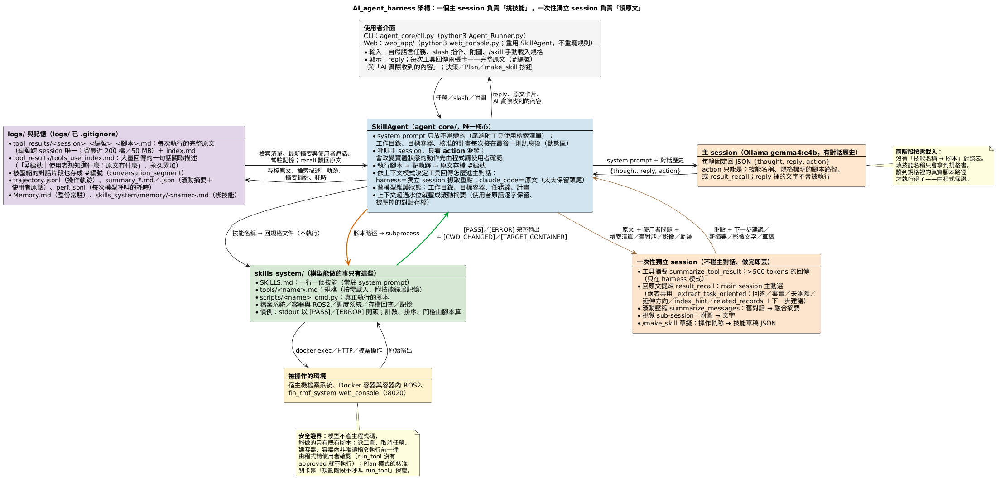
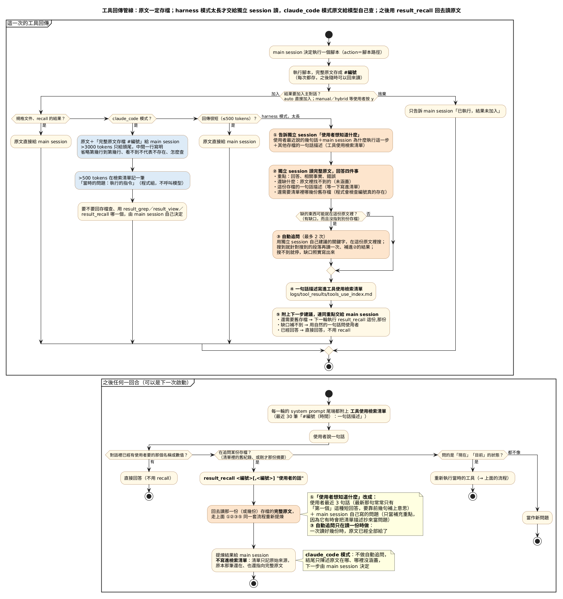

# AI_agent_harness

以本地 Ollama 模型（預設 `gemma4:e4b`）為核心的機器人維運助理，提供 CLI 與 Web 兩種介面。核心想法是**模型不寫程式、只挑技能**：可用的能力拆成一份輕量索引，加上一批規格文件與既有腳本；模型需要時才載入某個技能的規格，再依規格標明的腳本路徑執行。操作對象包含宿主機檔案系統、Docker 容器與容器內的 ROS2，以及 fih_rmf_system 的任務調度 web_console。決策模型刻意只用本地模型（離線的工廠環境）。

## 目前狀態（2026-09）

- **可用**：CLI 與 Web Console；26 個技能（檔案系統、容器與 ROS2、調度系統、多模態、工具結果存檔、記憶）；兩種可切換的上下文模式（`harness`／`claude_code`）；會改變實體狀態的動作執行前一律由程式請使用者確認；Plan 模式；`/make_skill` 把做對的對話整理成流程技能的規格（只用既有腳本）；Web 附圖的視覺分析；上下文自動壓縮（使用者原話逐字保留、被壓掉的對話也存檔可取回）；工具回傳原文存檔、跨 session 的工具使用檢索清單與 `result_recall`。
- **驗證方式**：`evals/` 的評測（12 個情境 × 兩種上下文模式，真模型、假的外部工具）；改動時另用假 `ollama.chat` 的 stub 測試。專案內還沒有單元測試套件。
- **主要限制**：小模型偶爾不下 `action` 或自己編結果；比較、計數要靠腳本先算好；檢索清單「跟哪一筆有關」仍由小模型判斷；claude_code 模式下，4B 模型常不會回存檔查被截掉的中段。完整清單見〈[設計筆記與已知限制](doc/設計筆記與已知限制.md#6-已知限制)〉。

## 運作方式



1. 使用者下指令，主 session 每輪回一個 JSON `{thought, reply, action}`，harness **只看 `action`**，`reply` 裡的文字不會被執行。
2. `action` 填技能名稱 → 回傳該技能的規格文件（這一輪不執行）；填規格標明的腳本路徑 → 才真的執行。沒有「技能名稱 → 腳本」的對照表，模型一定要先讀規格。會改變實體狀態的動作（派工單、取消任務、建容器、容器內非唯讀的指令）執行前一律由程式請使用者確認，任何模式都一樣。
3. 每次執行的完整原文都存成 `#編號` 並顯示給使用者。回傳怎麼進主對話看上下文模式：
   - **harness**（預設）：超過 500 tokens 時交給一次性的獨立 session，依使用者的問題擷取重點；主對話只收到重點與下一步建議。
   - **claude_code**：原文直接進上下文，超過 3000 tokens 保留頭尾並標明省略的行號與存檔編號；要不要回存檔查、用什麼查，由模型自己決定。
4. 大量回傳會在 `logs/tool_results/tools_use_index.md` 留下一句話描述（整句保存、不截斷），附在 system prompt 尾端；Web 附圖的影像分析也存成 `#編號` 記進這裡（標〔附圖分析〕）。使用者之後（包括下次啟動）追問舊資料時，模型執行 `result_recall <編號>`，讓獨立 session 回到原文重新提煉；問題要一起看幾份時，一次給多個編號。
5. system prompt 只放不常變的內容（KV cache 才能重用）；工作目錄、目標容器、核准的計畫這些常變的小東西，每次接在送出內容的最後面。
6. 上下文超過水位時，舊對話會融合成一份滾動摘要；使用者的原話由程式逐字保留，被壓掉的對話也存成 `#編號`，需要時可以取回。對話片段的描述只講那一段談了什麼、決定了什麼，列在 system prompt 的「過去的對話片段」一節，跟工具回傳分開列、保留上限也分開算（編號共用同一個序列，取回一樣用 `result_recall`）。claude_code 模式會先把舊的工具回傳清成「原文在存檔」的佔位，不夠才摘要。




每一步對應到哪個函式、狀態存在哪裡、要改某件事該看哪裡，見〈[架構說明](doc/架構說明.md)〉。

## 快速開始

**需要**：已在執行的 [Ollama](https://ollama.com/)（先 `ollama pull gemma4:e4b`）、Python 3.10+ 與 `pip install ollama`。附圖功能需要 `Pillow`；容器與 ROS2 技能需要宿主機的 `docker` CLI；調度系統技能需要 fih_rmf_system 的 web_console（:8020），離線時可用 `skills_system/scripts/mock_server.py` 代替。

```bash
python3 web_console.py      # Web：http://127.0.0.1:8765（只綁本機）
python3 Agent_Runner.py     # CLI
```

Web 左欄是對話，右欄是系統與工具回傳：每次工具回傳有兩張卡，一張是完整原文（附 `#編號`，可點開），一張是「AI 實際收到的內容」。輸入框打 `/` 會跳出指令與技能選單，旁邊有附圖（📷）與 Plan 模式（📝）按鈕。

| 常用指令 | 作用 |
|---|---|
| `/auto on` | 工具結果自動加入、連續執行到做完（Web 最多 25 輪） |
| `/hybrid on` | 每次問要不要加入，不論選哪個都繼續推論（預設的 manual 也會問，但選「不加入」就結束） |
| `/plan on` | 下一個任務先由 AI 列步驟草稿，核准（y）後才執行；草稿由系統保存，AI 只會改你提到的那幾條 |
| `/plan add`、`/plan edit N`、`/plan del N`、`/plan move N M`、`/plan show` | 直接改計畫草稿（不經過 AI）；沒開 `/plan on` 也能自己一條條列 |
| `/plan_exec_guard on` | 計畫執行中：計畫外、會改變狀態的技能不執行，AI 停下來會自動提醒繼續，連續失敗 3 次退出計畫（預設關＝沒有限制） |
| `/context_mode harness`、`/context_mode claude_code` | 切換上下文模式（差別見〈[架構說明 1.1](doc/架構說明.md#11-兩種上下文模式context_mode-harnessclaude_code)〉） |
| `/guard on`、`/guard off` | 執行前確認的開關（預設開；關閉只限這次執行） |
| `/skill <名稱>`、`/skills` | 手動載入某技能的規格／列出所有技能 |
| `/summarize off` | 大量回傳只給成功／失敗，不摘要 |
| `/make_skill <名稱>`、`/trajectory` | 把做對的對話整理成流程技能的規格（步驟只呼叫既有技能，不產生腳本）／查看操作軌跡 |
| `/compress`、`/clear` | 手動壓縮上下文／清空對話 |
| `/menu`（Web） | 列出全部指令 |

| 常用設定（環境變數） | 預設 | 說明 |
|---|---|---|
| `WEB_CONSOLE_MODEL` | `gemma4:e4b` | Web 用的主模型（CLI 寫在 `main()`） |
| `WEB_CONSOLE_HOST`／`WEB_CONSOLE_PORT` | `127.0.0.1`／`8765` | Web 綁定位址 |
| `AGENT_NUM_CTX` | `32768` | context 上限；記憶體小的設備可調低 |
| `AGENT_CONTEXT_MODE` | `harness` | 啟動時的上下文模式（`harness`／`claude_code`） |
| `AGENT_GUARDED_SKILLS` | 派工單、取消、刪逾時任務、建容器、容器內指令 | 執行前要確認的技能（逗號分隔） |
| `AGENT_SUMMARY_MODEL` | 同主模型 | 獨立 session 用的模型 |
| `RMF_WEB_CONSOLE_URL` | `http://localhost:8020` | 調度系統的位址 |
| `VISION_MODEL` | `gemma4:e4b` | 附圖分析用的模型 |

其他門檻與保留上限見〈[架構說明 §10](doc/架構說明.md#10-常數與環境變數)〉。

## 技能一覽

| 分類 | 技能 |
|---|---|
| 檔案系統 | `list_dir`、`search_text`、`find_file`、`change_dir`、`view_file` |
| 容器 | `docker_containers`、`docker_images`、`docker_est`、`docker_open`、`docker_runcmd` |
| ROS2（容器內） | `ROS2_topic_list`、`ROS2_topic_echo`、`ROS2_node_list`、`ROS2_node_info` |
| 調度系統 | `workpackage_send`、`workpackage_status`、`workpackage_cancel`、`overpending_cancel`、`semantic_map` |
| 多模態 | `stt_engine`、`image_inspect` |
| 工具結果存檔 | `result_recall`、`result_grep`、`result_view`、`result_list` |
| 記憶 | `modify_memory` |

索引在 [`skills_system/SKILLS.md`](skills_system/SKILLS.md)，每個技能的規格在 `skills_system/tools/<name>.md`；各技能的參數與重點見〈[設計筆記 §3](doc/設計筆記與已知限制.md#3-技能清單全部功能)〉。

## 目錄結構

```
AI_agent_harness/
├── Agent_Runner.py     # CLI 入口（幾行，實作在 agent_core/）
├── web_console.py      # Web 入口（幾行，實作在 web_app/）
├── agent_core/         # 核心：SkillAgent（由各 mixin 組成）、回覆協議、常數、CLI——唯一的核心邏輯來源
├── web_app/            # Web 介面（純標準庫）：狀態、回合流程、slash 指令、HTTP、static/index.html
├── AGENT.md            # system prompt 主體：角色、JSON 回覆格式、執行協議、安全原則、記憶協議
├── context_modes/      # 兩種上下文模式各自的規則（harness.md、claude_code.md），接在 AGENT.md 後面
├── Memory.md           # 全域長期記憶（每輪常駐）
├── skills_system/
│   ├── SKILLS.md       # 技能索引（常駐 system prompt）
│   ├── tools/          # 各技能的規格文件（按需載入）
│   └── scripts/        # 各技能實際執行的腳本與共用模組
├── vision/             # 多模態影像 library（擷取、推論、前端框選）
├── subagent/           # 獨立的框選截圖 → 視覺推論小工具
├── evals/              # 評測：同一組情境跑兩種上下文模式（run_evals.py、scenarios.py、perf_report.py）
├── doc/                # 架構說明、設計筆記、圖（.puml 與產生器）
└── logs/               # 執行時產生：工具回傳存檔、檢索清單、軌跡、摘要歸檔、模型呼叫耗時（.gitignore）
```

## 未來規劃的注意事項

接下來的方向是**執行設計好的技能與固定技能組**，而不是 coding 那種開放式任務：調度系統上的人機交握，以及引入心跳機制後的定時狀況回報、定期執行某些技能。心跳機制的起因是：未來會有來自不同地方的 VLM 語意資訊（例如各處攝影機的影像分析結果），需要 AI agent 分析、彙整之後才能回報，所以不是單純的定時腳本。設計時要注意：

- **模型選擇要在目標設備上量過再決定**：在 RTX 5090 上 gemma4:26b 兩種上下文模式都比 e4b 好、甚至略快（〈[設計筆記 2.11](doc/設計筆記與已知限制.md)〉與 `evals/results/`），但 26b 在弱設備上的主要代價是**讀 prompt**，不是產出：這次讀 prompt 就慢了 3 倍，而 system prompt 常駐約 5～8K tokens。另外 26b 模型本身 18 GB、e4b 9.6 GB，裝得下是前提。在目標設備上用 `evals/run_evals.py --model …` 與 `evals/perf_report.py` 實際量過才準；設備較弱時，e4b 搭配 harness 模式的時間與推論成本優勢比較大。
- **定時任務不一定要經過模型**：「定期執行某些技能」的步驟如果是固定的，排程直接執行腳本最穩、最省（`/make_skill` 產生的流程技能要由模型照步驟做，適合有人在場、要確認的流程；固定的多步驟要不經過模型，就寫成一支腳本）。模型只負責解讀結果、判斷異常、彙整多個來源（包括 VLM 的語意資訊）、寫報告，推論成本和出錯機會都會少很多。
- **心跳機制要注意上下文會越積越多**：長時間定時執行，每次都接在同一段對話後面，上下文會一直變長、壓縮一直觸發。建議每次心跳開一個乾淨的 session，只帶上次的結論（加上這次收到的 VLM 資訊與技能結果）。
- **無人值守時，執行前確認怎麼辦**：定時執行沒有人按「同意」。要事先決定：定時任務只准唯讀技能，或者給一份事先核准過的白名單。這一點現在的設計還沒處理（`guard.py` 目前一律要人確認）。
- **人機交握的時間限制**：現場等回應通常有時限，要把每個動作的延遲算進去。harness 模式大量回傳時會多一次獨立 session，在弱設備上可能要好幾秒。

## 文件

- 〈[架構說明](doc/架構說明.md)〉：`agent_core/` 與 `web_app/` 的完整解析，含每個模組負責什麼（先從第 0 節「工具回傳什麼時候會被摘要」看起）
- 〈[設計筆記與已知限制](doc/設計筆記與已知限制.md)〉：各機制的理由與實測數據、完整技能清單、驗證方法、已知限制、未來方向
- 〈[長期願景](doc/長期願景.md)〉：AGV/AMR 車隊調度場景的構想（尚未實作）
- 〈[評測](evals/README.md)〉：怎麼跑、情境清單、怎麼加情境、怎麼讀報表
- 圖的來源在 `doc/*.puml`，用 `python3 doc/流程圖產生器.py` 重新產生
