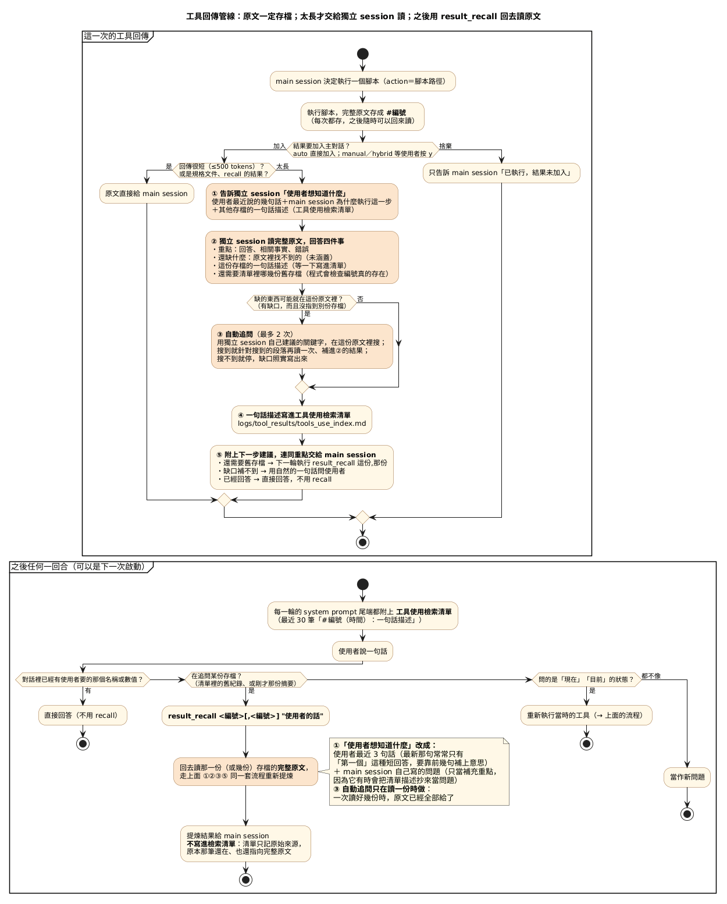

# Agent_Runner.py 架構說明

> 寫給：想看懂或修改 harness 核心的人。[README](../README.md) 是一頁總覽；這份把 `Agent_Runner.py`（約 3100 行）拆開講：由哪幾塊組成、一回合怎麼跑、工具回傳怎麼處理、狀態存在哪裡、要改某件事該看哪裡。每個機制「為什麼這樣做」與實測數據在〈[設計筆記與已知限制](設計筆記與已知限制.md)〉。文中的函式名稱都可以直接在 `Agent_Runner.py` 裡搜尋。

---

## 0. 先回答最常搞混的一題：工具回傳什麼時候會被摘要？

**每次執行腳本，完整原文一定會存檔（`#編號`）並顯示給使用者；要不要「摘要」只看大小。**

- **≤500 tokens**：原文直接進主對話，不開任何獨立 session。
- **>500 tokens**：harness 自動開一個一次性的獨立 session（`summarize_tool_result`），拿「完整原文＋使用者的目標＋這一步的目的＋工具使用檢索清單」擷取重點，主對話只收到重點與下一步建議。「工具回傳後馬上又跑一次獨立 session」就是這個：auto 模式下立刻發生；manual／hybrid 模式下在你按「加入」之後才發生（按捨棄就不花這次模型呼叫）。
- **`result_recall` 不是自動的**：它是一個技能，由 main session 判斷「使用者在追問某份存檔」時主動選用；harness 回去讀那一份（或幾份）存檔的完整原文，用同一套擷取邏輯、以使用者現在的問題為錨點重新提煉。

兩者共用同一個核心 `_extract_task_oriented`，差在觸發方式與錨點：

| | 工具摘要 `summarize_tool_result` | 回原文提煉 `result_recall` |
|---|---|---|
| 誰觸發 | harness 自動：回傳 >500 tokens 且要加入主對話 | main session 主動選（`action`） |
| 讀什麼 | 剛執行完的完整輸出 | 已存檔的 1～3 份完整原文 |
| 錨點 | 使用者的目標（Objective、任務線、計畫）＋這一步的目的（thought／reply／action） | 任務線（最新一句＋前幾句）＋模型給的聚焦點 |
| 自動追問（grep 同一份存檔） | 有，最多 2 跳 | 只讀一份時有 |
| 寫進檢索清單 | 會（只有原始工具的結果才寫） | 不會（它是衍生輸出） |
| 給 main session 的 | 重點＋下一步建議 | 重點＋下一步建議 |

---

## 1. 全貌

整個系統是「一個會挑技能的主 session，加上一群只負責讀原文的一次性 session」：

- **主 session**（Ollama `gemma4:e4b`，有對話歷史）每輪只回一個 JSON `{thought, reply, action}`。它不寫程式、不直接讀大量原文；`action` 只能填技能名稱、規格文件標明的腳本路徑，或 `result_recall`。
- **`SkillAgent`**（`Agent_Runner.py`）是唯一的核心：組 system prompt、呼叫主 session、依 `action` 派發、執行腳本、存檔、決定工具回傳怎麼進主對話、壓縮上下文、記操作軌跡。CLI（`main()`）與 Web（`web_console.py`）都只是它的外殼。
- **一次性獨立 session**：自己的 system／user prompt、不碰主對話、做完即丟，共五種（見第 7 節）。
- **技能系統 `skills_system/`**：索引（`SKILLS.md`，常駐）→ 規格（`tools/<name>.md`，按需載入）→ 腳本（`scripts/<name>_cmd.py`，真正執行）。沒有「技能名稱 → 腳本」的對照表：模型必須先載入規格、讀到真實的腳本路徑才執行得了。
- **`logs/`**：每次工具回傳的原文存檔、工具使用檢索清單、操作軌跡、滾動摘要歸檔（見第 8 節）。

---

## 2. 一回合怎麼跑（對照程式碼）

以 CLI 的 `main()` 為例（Web 的 `run_turn()` 是同一套步驟，對照見第 9 節）：

1. **收訊息**：slash 指令在 `main()` 的 if 鏈直接處理、不進模型。文字任務呼叫 `set_current_task()` 記進任務線 `task_history`（最近 3 句），上一個已核准的計畫自動清除；`/skill` 手動載入的規格用 `attach_skill_docs()` 附在訊息後；Plan 模式改走 `_run_plan_flow()`。
2. **組 prompt**：`ask_ai()` 每次都用 `get_system_prompt()` 重組第一則 system 訊息（組成順序見第 6 節），再由 `ensure_context_budget()` 檢查硬水位，超過就先同步壓縮。
3. **呼叫主 session**：`_chat_once()` 以 `format=AGENT_REPLY_SCHEMA` 強制 JSON，`parse_agent_reply()` 解析成 `{thought, reply, action, valid}`。不是合法 JSON 就只顯示、不執行；`reply` 空且 `action` 為 null 時，帶暫時提醒自動重試一次。
4. **派發**：`run_tool()` 只看 `action`：
   - `null` → 回合結束；
   - `command` 是技能名稱（`tools/<name>.md` 存在）→ 回傳規格文件（附技能經驗記憶），**不執行**；
   - `result_recall_cmd.py` → 在本程序內呼叫 `_result_recall()`（它要呼叫模型，不能包成 subprocess）；
   - 其他 → 當成腳本路徑，`_exec_script()` 以 subprocess 執行；找不到腳本就回可行動的 `[ERROR]`，提示先載入規格。
5. **落地**：`_sync_state_from_tool_output()` 讀 `[CWD_CHANGED]`／`[TARGET_CONTAINER]` 更新狀態；`_record_trajectory()` 記軌跡，並呼叫 `_archive_tool_result()` 把完整原文存成 `#編號`。
6. **模式決策**：auto 直接加入並續推；hybrid 問 y／n，n 改加「已捨棄」通知，兩者都續推；manual 按 y 加入並續推，n／stop 結束回合。
7. **決定進主對話的內容**（只有「加入」時才算）：`_content_for_context()` 決定給原文、摘要或只給成功／失敗（見第 3 節）；`tool_result_message()` 包上 `[tool result]` 與「系統回傳、不是使用者提供」框架句，以 user 角色加入 `messages`，然後回到步驟 2。
8. **回合結束**：`after_turn_compression()` 檢查軟水位，超過且可壓的內容夠多，就把舊訊息融合成滾動摘要。

---

## 3. 工具回傳管線

### 3.1 這一次的工具回傳（圖的上半部）

用一個實際例子走一遍：使用者問「tools 資料夾裡的每個技能，在 scripts 資料夾裡都有對應的腳本嗎？」，main session 執行 `ls skills_system/tools`，輸出約 850 tokens，超過 500，於是交給 `summarize_tool_result`：

1. **① 告訴獨立 session「使用者想知道什麼」**：使用者最近說的幾句話、main session 為什麼執行這一步（它的 thought／reply），以及檢索清單上其他存檔的一句話描述——例如「#1 腳本資料夾內容：skills_system/scripts，32 項」。
2. **② 獨立 session 讀完整原文，回答四件事**：
   - 重點：「tools 有 26 個檔案」＋檔名清單；
   - 還缺什麼：「原文沒有 scripts 資料夾的內容，沒辦法比對」；
   - 這份存檔的一句話描述：「tools 資料夾的技能列表：26 個檔案…」；
   - 還需要哪幾份舊存檔：「#1，scripts 的清單在那份」。程式會檢查 #1 真的在清單上，小模型編出來的編號會被丟掉。
3. **③ 自動追問**：只在「有缺口、而且沒指到別份存檔」時做，意思是缺的東西可能就藏在這份原文裡、摘要時沒看到（例如原文太長只讀了頭尾）。做法是拿獨立 session 自己建議的關鍵字在這份原文裡搜，搜到就針對那段再讀一次補上，搜不到就停。例子：讀 5 秒的 `/diagnostics` 後說「沒找到 motor_rear_left 的溫度」，並建議關鍵字 `motor_rear_left_temp`，一搜就找到「41.2」。上面 tools 的例子已經指到 #1，缺的在別份存檔裡，所以不追問。
4. **④ 一句話描述寫進工具使用檢索清單**（`tools_use_index.md`），之後每一輪都看得到。
5. **⑤ 附上下一步建議**，連同重點交給 main session。這個例子的建議是「下一輪執行 `result_recall 2,1 "<使用者的話>"`」：把 tools（#2）和 scripts（#1）兩份原文一起交給同一個獨立 session 比對。

對照程式碼：

| 步驟 | 函式 | 做什麼 |
|---|---|---|
| 存檔 | `_record_trajectory` → `_archive_tool_result` | 每次執行都存 `logs/tool_results/<session>_<編號>_<腳本>.md`（key: value 檔頭＋原文），`index.md` 追加一行 |
| 判斷 | `_content_for_context`、`is_exempt_result` | 規格文件、≤500 tokens、或本身已是提煉結果（`TOOL_SUMMARY_TAG` 開頭）→ 原文；`/summarize off` 或摘要失敗 → 只給成功／失敗 |
| 組錨點 | `summarize_tool_result`、`_build_task_anchor_text`、`_last_assistant_step` | 使用者的目標＋這一步的目的；原文超過 16000 字只讀頭尾（`_clip_tool_output`） |
| 擷取 | `_extract_with_followups` → `_extract_task_oriented` | 附上檢索清單（`_tool_use_catalog`，排除這一份），以 `format=TOOL_SUMMARY_SCHEMA` 取得 answer／facts／errors／not_covered／suggested_questions／index_hint／related_records |
| 自動追問 | `_extract_with_followups`、`_merge_followup` | 有缺口、沒有 related、未滿 2 跳時，用摘要自己給的關鍵字 `result_grep` 同一份存檔再擷取；0 行命中就停；結果併回第一輪（回答用新的、事實取聯集、index_hint 留第一輪） |
| 驗證 | `_validate_related` | related_records 只留清單裡真的有的編號，最多 2 筆 |
| 寫清單 | `_append_tool_use_index`、`clip_hint` | 只有原始工具的結果才寫一行進 `tools_use_index.md`（`result_*` 這類衍生輸出不寫）；描述用中文字數算，上限 50 字，一段英數算 1 字 |
| 排版 | `_render_tool_summary`、`_followup_guidance` | 回答／相關事實／錯誤／未涵蓋／還需要的舊存檔／延伸方向（不附 grep 關鍵字），結尾附下一步建議 |

下一步建議（`_followup_guidance`）依序判斷：

1. 還需要之前的存檔 → 直接給合併指令 `result_recall 這份,那份 "<使用者的話>"`（幾份交給同一個獨立 session，才比得了）；
2. 自動追問也解不開的缺口 → 用自然的一句話問使用者；
3. 已經回答 → 直接回答，不必 recall。

「什麼時候不需要 recall」由看過完整原文的獨立 session 明說，main session 不必自己猜。

### 3.2 之後任何一回合（圖的下半部）

`get_system_prompt()` 尾端由 `_tool_use_index_block()` 注入檢索清單最近 30 筆（格式 `#編號（時間）：描述`），並附上依序判斷的規則：對話裡已經有答案 → 直接回答；在接續某份存檔 → `result_recall`；問「現在」的狀態 → 重新執行工具；都不像 → 當作新問題。

main session 執行 `result_recall <編號>[,<編號>] "<使用者的話>"` 時，`_result_recall()` 回去讀那一份（或幾份）存檔的完整原文，走上面 ①②③⑤ 同一套流程重新提煉。跟 3.1 不同的只有三點：

- **①「使用者想知道什麼」怎麼給**：用 harness 自己記的使用者最近 3 句話（任務線），最新一句當問題、前兩句當背景。因為使用者回答追問時常常只說「第一個」「好」「那溫度呢」，單看這一句不知道在問什麼，要靠前幾句補上意思。這是實際發生過的：`result_recall` 以前只拿最新一句，結果獨立 session 收到的問題是「第一個」。
- **main session 寫的那段問題只當補充重點**：`result_recall 12 "哪些檔案跟記憶有關"` 引號裡是 main session 自己寫的，harness 不直接拿它當使用者的問題，只附在後面當「要特別注意的點」。原因也是實測：小模型有時會把清單上的描述抄進引號（例如「列出 skills_system/scripts 資料夾內所有腳本檔案…」），拿它當問題就錨錯了；跟使用者原話或清單描述一模一樣時，乾脆不附。
- **③ 自動追問只在讀一份時做**：一次讀好幾份時，每一份的原文都已經給了，而且自動追問的搜尋一次只能搜一份存檔。

**提煉結果不寫進檢索清單。**清單記的是「原始來源」：每一筆代表一份原始工具輸出、指向它的完整原文。recall 沒有產生新資料，只是換一個問題重讀已經存在的原文。如果把它也寫進去：

- 同一份來源會在清單上佔兩格（例如 #12 是 tools 清單，recall 後的 #13 又描述一次 tools 清單），30 筆的顯示視窗很快被重複的內容佔滿；
- recall 的存檔裡只有「提煉後的重點」，不是完整原文。之後如果有人 recall 到這一筆，獨立 session 讀到的是摘要的摘要，資訊比直接 recall #12 少。

所以原本那一筆（#12）留在清單上、繼續指向完整原文；recall 本身仍然記進操作軌跡和 `index.md`（所有執行的稽核清單），只是不進檢索清單。另外，recall 的輸出開頭是 `TOOL_SUMMARY_TAG`，交給 `_content_for_context` 時會被判定成「已經提煉過」，直接給 main session，不會再摘要一次。

### 3.3 為什麼編號跨 session 唯一

`SkillAgent.__init__` 從既有存檔的最大編號續編（`_max_archived_id`），所以清單上的 `#16` 在任何一次啟動都只指向同一份存檔，模型只要抄數字。要整個重來，請刪整個 `logs/tool_results/`（連同 `tools_use_index.md`）；只刪存檔會讓編號重新從 1 起算，跟清單對不上。

---

## 4. 檔案地圖

`Agent_Runner.py` 由上到下（行號是 2026-09-26 的大約位置，之後改動會位移）：

| 約略行號 | 區塊 | 主要內容 |
|---|---|---|
| 1–115 | `SkillAgent.__init__` | 所有狀態的初始值（見第 5 節） |
| 116–177 | token 計量 | `count_tokens`（字元數 ÷ 校準比）、`context_tokens`、`_record_usage`（用 Ollama 回報的 `prompt_eval_count` 校準） |
| 178–530 | 上下文壓縮 | `_split_for_compression`（保留區的切點，不拆開指令與結果）、`summarize_messages`（滾動摘要 session）、`_apply_compression`、`compress_context_to_file`、背景壓縮、`ensure_context_budget`（硬水位） |
| 531–832 | 工具回傳的任務導向擷取 | `_render_tool_summary`、`_extract_task_oriented`、`_extract_with_followups`、`_merge_followup`、`_validate_related`、`_followup_guidance`、`summarize_tool_result` |
| 833–1033 | system prompt | `load_long_term_memory`、Plan 請求與核准、`_build_objective_prompt`、`_build_plan_context_prompt`、`_build_task_anchor_text`、檢索清單三件組（`_tool_use_index_block`／`_tool_use_index_rows`／`_tool_use_catalog`）、`get_system_prompt` |
| 1034–1144 | 對話與主模型 | `set_current_task`、`reset_conversation`（/clear）、`ask_ai`（含空白回覆重試）、`_chat_once`、`parse_reply` |
| 1145–1249 | 技能載入 | `list_skills`（解析 SKILLS.md）、`manual_skill_block`（/skill）、`_load_skill_doc`（規格＋經驗記憶）、參數拆解、狀態標記同步 |
| 1250–1443 | 派發與執行 | `run_tool`、`_exec_script`（subprocess、環境變數、600 秒防線）、`_result_recall` |
| 1444–1665 | 軌跡與存檔 | `_record_trajectory`、`_archive_tool_result`、`_prune_tool_results`、`update_result_answer`、`_append_tool_use_index`、`result_file_path`（Web 開原文用）、軌跡起點 |
| 1666–2270 | `/make_skill` | 挑步驟、草擬 session、驗證草稿、產生規格與組合腳本、重播驗證、註冊；CLI 與 Web 共用的草稿狀態機 |
| 2271–2328 | CLI 輔助流程 | `_append_discarded_tool_result`、`_run_plan_flow`（規劃階段不呼叫 `run_tool`） |
| 2329–2720 | 常數、schema、模組函式 | 水位與門檻、`AGENT_REPLY_SCHEMA`、`parse_agent_reply`、`action_text`、`clip_hint`、`tool_result_message`、`SUMMARY_SCHEMA`、`TOOL_SUMMARY_SCHEMA`、`MAKE_SKILL_SCHEMA`、`is_exempt_result` |
| 2722–2848 | 回合層的共用函式 | `_content_for_context`（工具回傳進主對話的三條路）、`context_kind`、`after_turn_compression`（軟水位）、`_run_make_skill_flow` |
| 2849–3102 | `main()` | CLI REPL：slash 指令、Plan 模式、回合迴圈、auto／hybrid／manual 決策 |

常數集中在檔案後段、方法在前段：Python 在呼叫時才解析全域名稱，所以方法可以引用後面才定義的常數。

---

## 5. SkillAgent 的狀態

| 類別 | 屬性 | 說明 |
|---|---|---|
| 對話 | `messages`、`messages_lock` | 第一則永遠是 system prompt（每次 `ask_ai` 重組），之後是 user／assistant；工具回傳以 user 角色、`[tool result]` 開頭 |
| 任務錨點 | `current_task`、`task_history`、`sticky_objective`、`current_plan` | 給獨立 session 當「使用者的目標」；計畫與 Objective 另外常駐 system prompt |
| 環境狀態 | `current_cwd`、`container_cwd`、`target_container` | 由腳本輸出的狀態標記同步；顯示在 Current Agent State，並以 cwd／環境變數傳給腳本 |
| token 計量 | `chars_per_token`、`last_prompt_tokens`、`total_*_tokens` | 估算與校準（Ollama 沒有 tokenize API） |
| 壓縮 | `rolling_summary`、`_compress_thread`、`last_compression` | 最新一份滾動摘要（啟動時從 `logs/` 載入）、背景壓縮執行緒 |
| 存檔與軌跡 | `session_id`、`trajectory`、`trajectory_seq`、`last_result_id`、`last_result_file`、`last_tool_summary` | 編號＝軌跡 id，跨 session 續編 |
| make_skill | `pending_skill_draft`、`skill_model`、`drafts_dir` | 等待核准的技能草稿 |

`/clear`（`reset_conversation`）只清對話、計畫與任務線；滾動摘要、工作目錄、目標容器、Objective、存檔與檢索清單都不清。

---

## 6. system prompt 的組成順序

`get_system_prompt()` 每次呼叫主模型前重組，依序是：

1. `AGENT.md`：角色、JSON 回覆格式、執行協議、安全原則、記憶協議
2. Current Agent State：工作目錄、容器內目錄、目標容器
3. Objective（有設定時）
4. 已核准的計畫（Plan 模式核准後，到下一個新任務為止）
5. `Memory.md`（最後 30 行）
6. 最新一份滾動摘要
7. `SKILLS.md` 技能索引
8. 工具使用檢索清單（最近 30 筆，有存檔時才出現）

放在 system prompt、而不是 `messages` 裡的內容，不會被壓縮沖掉。

---

## 7. 五種一次性獨立 session

| session | 方法 | 什麼時候跑 | 輸入 | 輸出（Ollama `format=`） |
|---|---|---|---|---|
| 工具摘要 | `summarize_tool_result` | 工具回傳 >500 tokens 且要加入主對話 | 原文＋使用者目標＋這一步的目的＋檢索清單 | `TOOL_SUMMARY_SCHEMA` |
| 回原文提煉 | `_result_recall` | main session 執行 `result_recall` | 1～3 份存檔原文＋任務線＋聚焦點＋檢索清單 | `TOOL_SUMMARY_SCHEMA` |
| 滾動壓縮 | `summarize_messages` | 回合結束超過軟水位、呼叫前超過硬水位、或 `/compress` | 上一份摘要＋要壓的舊訊息 | `SUMMARY_SCHEMA` |
| 視覺 | `web_console._run_vision_subsession`（`vision.analyze`） | Web 附圖時 | 影像＋使用者訊息 | 文字，以 `[vision result]` 附在訊息後 |
| 技能草擬 | `draft_skill_from_trajectory` | `/make_skill` | 軌跡步驟＋計畫＋任務 | `MAKE_SKILL_SCHEMA` |

前三種用 `summary_model`（`AGENT_SUMMARY_MODEL`，預設同主模型）並關閉 thinking（`think=False`）。與主模型相同時，Ollama 單 slot 會讓它們跟主對話依序執行，每次多等幾秒。

---

## 8. 存在哪裡、活多久

| 路徑 | 內容 | 誰寫 | 保留 |
|---|---|---|---|
| `logs/tool_results/<session>_<編號>_<腳本>.md` | 每次執行腳本的完整原文（技能規格載入不存） | `_archive_tool_result` | 最近 200 檔／50 MB，超過刪最舊的 |
| `logs/tool_results/index.md` | 每份存檔一行（編號、腳本、狀態、任務、摘要回答），`result_list` 讀它 | `_archive_tool_result`、`update_result_answer` | 跟著存檔一起刪 |
| `logs/tool_results/tools_use_index.md` | 大量回傳的一句話關聯描述，system prompt 尾端顯示最近 30 筆 | `_append_tool_use_index` | 永久累加 |
| `logs/trajectory.jsonl` | 每次執行與起點（/clear、計畫核准、make_skill） | `_append_trajectory_log` | 永久累加 |
| `logs/summary_*.md`／`.json` | 滾動摘要歸檔；啟動時載入最新一份 | `_archive_summary` | 最近 30 份 |
| `Memory.md` | 全域記憶（使用者明確要求時寫入），system prompt 帶最後 30 行 | `modify_memory` | 手動管理 |
| `skills_system/memory/<name>.md` | 綁定某技能的經驗記憶，載入該技能規格時附上 | `modify_memory --skill` | 手動管理 |
| `skills_system/drafts/<name>/` | `/make_skill` 還沒核准的草稿 | `write_skill_draft` | 核准或取消時刪除 |

`logs/` 與 `skills_system/drafts/` 都在 `.gitignore`（工具輸出可能含敏感內容）。

---

## 9. CLI 與 Web Console 的對應

`web_console.py` 不重寫任何規則，只把同一套步驟改成「每個 HTTP 請求處理一段、以 NDJSON 串流逐筆推事件」：

| 步驟 | CLI（`Agent_Runner.main()`） | Web（`web_console.py`） |
|---|---|---|
| 收訊息 | `input()` 迴圈 | `POST /api/send` → `_handle_send` |
| slash 指令 | `main()` 的 if 鏈 | `handle_slash_command` |
| 回合迴圈 | `while True`（沒有輪數上限） | `run_turn`（auto 最多 25 輪） |
| 工具結果決策 | `input()` 問 y／n／stop | `POST /api/decision` → `apply_decision` |
| 進主對話的內容 | `_context_content_for_cli` → `_content_for_context` | `_content_for_context` ＋ `_emit_context_event` |
| Plan 模式 | `_run_plan_flow` | `start_plan_flow`、`handle_plan_response`（Plan 鈕＝`/plan on`／`off`） |
| /make_skill | `_run_make_skill_flow` | `handle_skill_draft_response` |
| 附圖 | 無 | `_run_vision_subsession` |
| 回合結束 | `after_turn_compression` | `after_turn_compression` |

---

## 10. 常數與環境變數

| 常數 | 預設 | 環境變數 | 作用 |
|---|---|---|---|
| `NUM_CTX` | 32768 | `AGENT_NUM_CTX` | 每次請求的 context 上限，所有 session 共用 |
| `TOKEN_THRESHOLD`／`SOFT_TOKEN_THRESHOLD` | NUM_CTX×0.75／×0.60 | `AGENT_HARD_RATIO`／`AGENT_SOFT_RATIO` | 硬水位（呼叫前一定壓）／軟水位（回合結束後壓） |
| `KEEP_RECENT_TOKENS` | NUM_CTX×0.15 | — | 壓縮時保留最新這麼多 token 的原文 |
| `TOOL_RESULT_TOKEN_THRESHOLD` | 500 | — | 工具回傳超過就交給工具摘要 session |
| `TOOL_SUMMARY_DEFAULT` | 開 | `AGENT_TOOL_SUMMARY` | `/summarize` 的啟動值 |
| `TOOL_SUMMARY_INPUT_MAX_CHARS` | 16000 | `AGENT_TOOL_SUMMARY_INPUT_CHARS` | 獨立 session 一次最多讀多少原文（超過只讀頭尾） |
| `TOOL_SUMMARY_MAX_FOLLOWUP_HOPS` | 2 | `AGENT_TOOL_SUMMARY_MAX_HOPS` | 自動追問最多幾跳 |
| `TOOL_USE_INDEX_SHOW` | 30 | `AGENT_TOOL_USE_INDEX_SHOW` | 檢索清單顯示筆數；0 關閉顯示（寫入不受影響） |
| `TOOL_USE_INDEX_HINT_MAX` | 50 | — | 關聯描述上限（中文字數，一段英數算 1 字） |
| `RECALL_MAX_RECORDS` | 3 | — | `result_recall` 一次最多讀幾份 |
| `TOOL_RESULTS_KEEP`／`TOOL_RESULTS_MAX_MB` | 200／50 | `AGENT_TOOL_RESULTS_KEEP`／`AGENT_TOOL_RESULTS_MAX_MB` | 原文存檔的保留上限 |
| `SUMMARY_ARCHIVE_KEEP` | 30 | `AGENT_SUMMARY_KEEP` | 滾動摘要歸檔份數 |
| `SUMMARY_MODEL`／`SKILL_MODEL` | 同主模型 | `AGENT_SUMMARY_MODEL`／`AGENT_SKILL_MODEL` | 獨立 session／make_skill 草擬用的模型 |
| `PARALLEL_CAL_DEFAULT` | 關 | `AGENT_PARALLEL_CAL` | 軟水位壓縮改在背景執行緒 |
| `TOOL_EXEC_TIMEOUT` | 600 秒 | — | 單一腳本的最後防線逾時 |

---

## 11. 要改某件事，該看哪裡

| 想做的事 | 看哪裡 |
|---|---|
| 改主模型的行為規則 | `AGENT.md`（整份進 system prompt）；只跟某個技能有關的引導放 `tools/<name>.md` |
| 新增技能 | `skills_system/tools/<name>.md` ＋ `scripts/<name>_cmd.py` ＋ `SKILLS.md` 一行；或用 `/make_skill` 把做對的步驟編成組合技能 |
| 改工具摘要要擷取什麼 | `_extract_task_oriented` 的 prompt 與 `TOOL_SUMMARY_SCHEMA` |
| 改摘要結尾的下一步建議 | `_followup_guidance` |
| 改檢索清單的顯示或判斷規則 | `_tool_use_index_block` |
| 改 recall 的錨點或多份讀取 | `_result_recall` |
| 改什麼時候摘要 | `TOOL_RESULT_TOKEN_THRESHOLD`、`is_exempt_result`、`_content_for_context` |
| 改滾動壓縮 | `_summary_prompts`、`_split_for_compression`、水位常數、`after_turn_compression` |
| 改回覆協議 | `AGENT_REPLY_SCHEMA`、`parse_agent_reply`、`AGENT.md` 第 3 條 |
| 改 Web 畫面 | `web_console.py` 的 `HTML_PAGE`（HTML／CSS／JS 都在裡面） |
| 重畫文件的圖 | 改 `doc/*.puml`，執行 `python3 doc/流程圖產生器.py`（需要網路） |

改完之後的驗證方法（假 `ollama.chat` 的 stub 測試＋真模型情境）見〈設計筆記與已知限制〉5.4。
